

  

# Universidad Peruana de Ciencias Aplicadas

## Carrera de Ingeniería de Software

Ciclo: 2024 - 0 2

Curso: Desarrollo de Aplicaciones Open Source

Sección: SW54

Profesor: Alberto Wilmer Sanchez Seña

Informe del Trabajo Final

Startup: 

Producto: 

|          Integrantes           |   Código   |
| :----------------------------: | :--------: |
|      Ramos Carpio, Karen       | U20201E493 |
|      Arce Huaman Luis Andres   | U20201A300 |
|      Ramos Huamanchumo, Javier | U201719648 |
|      Pinto Fuentes Rivera, Alvaro Felipe | U202213384 |

Agosto del 2024

 
 
 
 
 
 
 
 
 

# Registro de Versiones del Informe

<table>
  <thead>
    <tr>
        <th>Versión</th>
        <th>Fecha</th>
        <th>Autor</th>
        <th>Descripción de modificación</th>
    </tr>
  </thead>
  <tbody>
  <tr>
      <td><strong>TB1</strong></td>
      <td></td>
      <td>
        <ul>
          <li>Ramos Carpio, Karen</li>
          <li>Arce Huaman, Luis Andres</li>
          <li>Pinto Fuentes Rivera, Alvaro Felipe</li>
        </ul>
      </td>
      <td>
        Se han incluído los siguientes capítulos:
        <ul>
          <li>Capítulo I: Introducción</li>
          <li>Capítulo II: Requirements Elicitation & Analysis</li>
          <li>Capítulo III: Requirements Specification</li>
          <li>Capítulo IV: Product Design</li>
          <li>Avance del Capítulo V: Product Implementation, Validation & Deployment hasta el punto 5.2.1.8</li>
          <li>Avance de Conclusiones, Bibliografía y Anexos</li>
        </ul>
      </td>
  </tr>
  </tbody>
</table>

 
 
 
 
 
 
 
 
 
 
 
 
 

# Student Outcome

<table style="border-collapse: collapse; width: 100%; border: 1px solid black;">
  <thead>
    <tr style="border-bottom: 1px solid black;">
      <th style="border-right: 1px solid black;">Criterio Específico</th>
      <th style="border-right: 1px solid black;">Acciones Realizadas</th>
      <th>Conclusiones</th>
    </tr>
  </thead>
  <tbody>
    <tr style="border-bottom: 1px solid black;">
      <td style="border-right: 1px solid black;"><strong>Comunica en forma escrita ideas y/o resultados con objetividad a público de diferentes especialidades y niveles jerárquicos, en el marco del desarrollo de un proyecto en ingeniería</strong></td>
      <td style="border-right: 1px solid black;">
        <ul>
          
<strong>TB1</strong>

          <li></li>
        </ul> 
      </td>
      <td><strong>TB1:</strong>
 

      </td>
    </tr>
    <tr style="border-bottom: 1px solid black;">
      <td style="border-right: 1px solid black;"><strong>Comunica oralmente sus ideas y/o resultados con objetividad a público de diferentes especialidades y niveles jerárquicos, en el marco del desarrollo de un proyecto en ingeniería</strong></td>
      <td style="border-right: 1px solid black;">
          <ul>
            
<strong>TB1</strong>

            <li></li>
          </ul> 
        </td>
        <td><strong>TB1:</strong>
 

        </td>
    </tr>
  </tbody>
</table>

# **Project Report Online**

URL Project Report (Github):
          
# Contenido
## Tabla de contenidos

### [Capítulo I: Introducción]()
- [1.1. Startup Profile]()
    - [1.1.1 Descripción de la Startup]()
    - [1.1.2 Perfiles de integrantes del equipo]()
- [1.2 Solution Profile]()
    - [1.2.1 Antecedentes y problemática]()
    - [1.2.2 Lean UX Process]()
        - [1.2.2.1. Lean UX Problem Statements]()
        - [1.2.2.2. Lean UX Assumptions]()
        - [1.2.2.3. Lean UX Hypothesis Statements]()
        - [1.2.2.4. Lean UX Canvas]()
- [1.3. Segmentos objetivo]()

### [Capítulo II: Requirements Elicitation & Analysis]()
- [2.1. Competidores]()
    - [2.1.1. Análisis competitivo]()
    - [2.1.2. Estrategias y tácticas frente a competidores]()
- [2.2. Entrevistas]()
    - [2.2.1. Diseño de entrevistas]()
    - [2.2.2. Registro de entrevistas]()
    - [2.2.3. Análisis de entrevistas]()
- [2.3. Needfinding]()
    - [2.3.1. User Personas]()
    - [2.3.2. User Task Matrix]()
    - [2.3.3. User Journey Mapping]()
    - [2.3.4. Empathy Mapping]()
    - [2.3.5. As-is Scenario Mapping]()
- [2.4. Ubiquitous Language]()

### [Capítulo III: Requirements Specification]()
- [3.1. To-Be Scenario Mapping]()
- [3.2. User Stories]()
- [3.3. Impact Mapping]()
- [3.4. Product Backlog]()

### [Capítulo IV: Product Design]()
- [4.1. Style Guidelines]()
    - [4.1.1. General Style Guidelines]()
    - [4.1.2. Web Style Guidelines]()
- [4.2. Information Architecture]()
    - [4.2.1. Organization Systems]()
    - [4.2.2. Labeling Systems]()
    - [4.2.3. SEO Tags and Meta Tags]()
    - [4.2.4. Searching Systems]()
    - [4.2.5. Navigation Systems]()
- [4.3. Landing Page UI Design]()
    - [4.3.1. Landing Page Wireframe]()
    - [4.3.2. Landing Page Mock-up]()
- [4.4. Web Applications UX/UI Design]()
    - [4.4.1. Web Applications Wireframes]()
    - [4.4.2. Web Applications Wireflow Diagrams]()
    - [4.4.3. Web Applications Mock-ups]()
    - [4.4.4. Web Applications User Flow Diagrams]()
- [4.5. Web Applications Prototyping]()
- [4.6. Domain-Driven Software Architecture]()
    - [4.6.1. Software Architecture Context Diagram]()
    - [4.6.2. Software Architecture Container Diagrams]()
    - [4.6.3. Software Architecture Components Diagrams]()
- [4.7. Software Object-Oriented Design]()
    - [4.7.1. Class Diagrams]()
    - [4.7.2. Class Dictionary]()
- [4.8. Database Design]()
    - [4.8.1. Database Diagram]()

### [Capítulo V: Product Implementation, Validation & Deployment]()
- [5.1. Software Configuration Management]()
    - [5.1.1. Software Development Environment Configuration]()
    - [5.1.2. Source Code Management]()
    - [5.1.3. Source Code Style Guide & Conventions]()
    - [5.1.4. Software Deployment Configuration]()
- [5.2. Landing Page, Services & Applications Implementation]()
    - [5.2.1. Sprint 1]()
        - [5.2.1.1. Sprint Planning 1]()
        - [5.2.1.2. Sprint Backlog 1]()
        - [5.2.1.3. Development Evidence for Sprint Review]()
        - [5.2.1.4. Testing Suite Evidence for Sprint Review]()
        - [5.2.1.5. Execution Evidence for Sprint Review]()
        - [5.2.1.6. Services Documentation Evidence for Sprint Review]()
        - [5.2.1.7. Software Deployment Evidence for Sprint Review]()
        - [5.2.1.8. Team Collaboration Insights during Sprint]()
    - [5.2.2. Sprint 2]()
        - [5.2.2.1. Sprint Planning 2]()
        - [5.2.2.2. Sprint Backlog 2]()
        - [5.2.2.3. Development Evidence for Sprint Review]()
        - [5.2.2.4. Testing Suite Evidence for Sprint Review]()
        - [5.2.2.5. Execution Evidence for Sprint Review]()
        - [5.2.2.6. Services Documentation Evidence for Sprint Review]()
        - [5.2.2.7. Software Deployment Evidence for Sprint Review]()
        - [5.2.2.8. Team Collaboration Insights during Sprint]()
    - [5.2.3. Sprint 3]()
        - [5.2.3.1. Sprint Planning 3]()
        - [5.2.3.2. Sprint Backlog 3]()
        - [5.2.3.3. Development Evidence for Sprint Review]()
        - [5.2.3.4. Testing Suite Evidence for Sprint Review]()
        - [5.2.3.5. Execution Evidence for Sprint Review]()
        - [5.2.3.6. Services Documentation Evidence for Sprint Review]()
        - [5.2.3.7. Software Deployment Evidence for Sprint Review]()
        - [5.2.3.8. Team Collaboration Insights during Sprint]()
    - [5.2.4. Sprint 4]()
        - [5.2.4.1. Sprint Planning 4]()
        - [5.2.4.2. Sprint Backlog 4]()
        - [5.2.4.3. Development Evidence for Sprint Review]()
        - [5.2.4.4. Testing Suite Evidence for Sprint Review]()
        - [5.2.4.5. Execution Evidence for Sprint Review]()
        - [5.2.4.6. Services Documentation Evidence for Sprint Review]()
        - [5.2.4.7. Software Deployment Evidence for Sprint Review]()
        - [5.2.4.8. Team Collaboration Insights during Sprint]()
- [5.3. Validation Interviews]()
    - [5.3.1. Diseño de Entrevistas]()
    - [5.3.2. Registro de Entrevistas]()
    - [5.3.3. Evaluaciones según heurísticas]()
- [5.4. Video About-the-Product]()

---
# Capítulo I: Introducción
## 1.1. Startup Profile
### 1.1.1 Descripción de la Startup
### 1.1.2 Perfiles de integrantes del equipo
## 1.2 Solution Profile
### 1.2.1 Antecedentes y problemática
### 1.2.2 Lean UX Process
#### 1.2.2.1. Lean UX Problem Statements
#### 1.2.2.2. Lean UX Assumptions
#### 1.2.2.3. Lean UX Hypothesis Statements
#### 1.2.2.4. Lean UX Canvas
## 1.3. Segmentos objetivo
# Capítulo II: Requirements Elicitation & Analysis
## 2.1 Competidores
## 2.2. Entrevistas
### 2.2.1. Diseño de entrevistas
### 2.2.2. Registro de entrevistas
### 2.2.3. Análisis de entrevistas
## 2.3. Needfinding
### 2.3.1. User Personas
### 2.3.2. User Task Matrix
### 2.3.3. User Journey Mapping
### 2.3.4. Empathy Mapping
### 2.3.5. As-is Scenario Mapping
## 2.4. Ubiquitous Language
# Capítulo III: Requirements Specification
## 3.1. To-Be Scenario Mapping
## 3.2. User Stories
## 3.3. Impact Mapping
## 3.4. Product Backlog
# Capítulo IV: Product Design
## 4.1. Style Guidelines
### 4.1.1 General Style Guidelines
**Paleta de colores**: Nuestra selección en la paleta de colores se basa en la atención a la legibilidad y buen aspecto de nuestra landing page. El color #002e43 se usa como color principal para resaltar elemento importantes, luego el color #406378 se usa para subtítulos y otros apartados de una ligera menor relevancia, en el caso del color #6a90a9 se utiliza en el cuerpo y en otras áreas para contrastar con los títulos y subtítulos, finalmente para los colores #b2c3d3 y #d7dce0 se usarán de fondo. Estos colores se usarán de forma inteligente para poder presentar una jerarquía visual clara e intuitiva.

  

**Branding**: Para el branding de nuestra empresa se creó el nombre de la marca con el objetivo de establecer una identidad, presencia relevante e imponente en el mercado. Para una mejor identificación de nuestra empresa se creó el logo:

 

**Tipografía**: Para dar una aire diferente a nuestra marca se ha optado por el uso de la fuente “Reboto Mono” que presenta una gran variedad de estilos. Esta fuente debe ser símbolo de nuestra marca y de cumplir el objetivo de transmitir información con una identidad visual sólida y reconocible. Adicionalmente, esta tipografía es apropiada para lograr un diseño cohesivo y equilibrado que contribuye a nuestro reconocimiento en el mercado objetivo.

  

**Spacing**: Se hará uso de un espaciado pertinente para no abrumar al cliente con textos abarrotados que no contribuyen a la estética y contrariamente desmotivan a leer. Además, un correcto uso del espaciado en el texto también puede dar la impresión de una página más limpia y moderna, que es uno de los objetivos que hemos planteado para crear un mejor ambiente para el cliente.

**Tono de comunicación**: El tono usado en el proyecto será del tipo formal, además de que se usará un lenguaje respetuoso, con el objetivo de mantener una comunicación estrictamente profesional con el cliente. Sin embargo, en algunas secciones se usará también un tono entusiasta o sereno para atraer al cliente a probar el producto.

### 4.1.2 Web Style Guidelines

**Colores**: En nuestro enfoque para diseñar nuestra página web, hemos elegido cuidadosamente una paleta de colores que refleje la identidad y los valores de nuestra marca. Con el azul eléctrico como color principal, buscamos transmitir una sensación de energía, modernidad y confianza a nuestros visitantes.Adicionalmente utilizamos colores complementarios como #406378,#6a90a9 ,#b2c3d3,#d7dce0 y el color negro para dar contraste en los menus.

  

**Tipografía**: Además, hemos optado por emplear la tipografía Reboto Mono debido a su estilo moderno y legible, que se alinea perfectamente con la estética contemporánea que deseamos transmitir en nuestra página web, adicionalmente pensamos usar los distintos tamaños de letra según sea necesario en el texto de cara a dar una mejor perspectiva de jerarquía en el texto, así podremos separar los títulos, subtítulos y el cuerpo de una mejor forma.

  

**Formas**: Se decidió emplear figuras con bordes ligeramente redondeados en el proyecto para proporcionar una apariencia más ordenada y pulida, lo que contribuye a una experiencia visual más agradable para los usuarios.

Además, en el desarrollo de nuestros mock-ups y wireframes, se emplearon dos tipos de pantallas comunes: escritorio y móvil. La versión de escritorio estuvo más dirigida a nuestro segmento de administradores del taller, mientras que la versión móvil estuvo destinada al segmento de propietarios de vehículos.

## 4.2. Information Architecture

### 4.2.1 Organization Systems:

Usaremos la organización visual de contenido de forma jerárquica para el inicio de forma, más específicamente el patrón H o también llamado Hierarchical que nos otorga una estructura organizativa clara y jerárquica para los componentes de nuestor sistema, además este contribuye a la reutilización de componentes y escalabilidad lo que acelera el proceso de desarrollo. En términos de esquemas de categorización usaremos el estilo por tópicos ya que cada sección toca un tema o funcionalidad diferente, también dentro de cada pestaña podemos encontrar todas las funcionalidades relacionadas a dicha pestaña.

  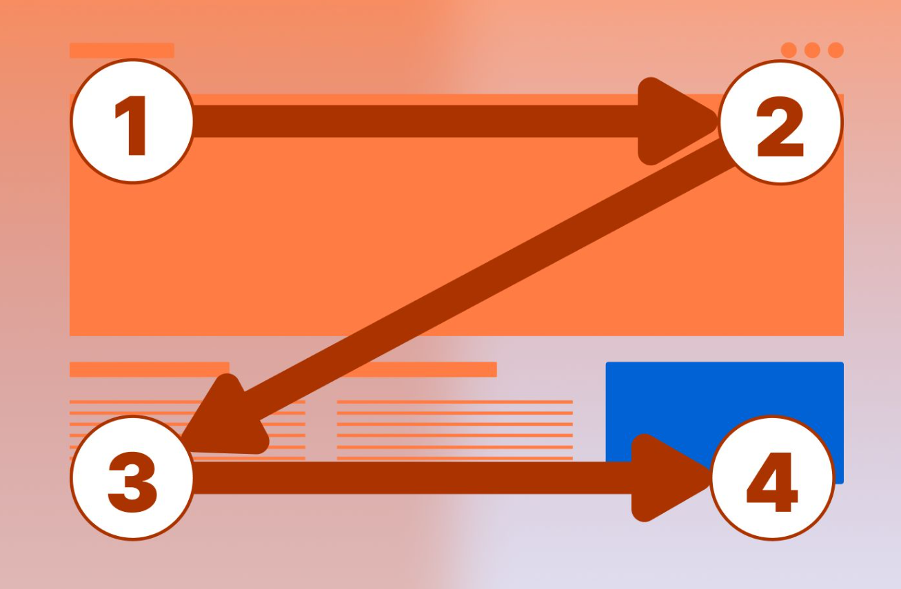

### 4.2.2 Labeling Systems:

Aplicación web celulares:

  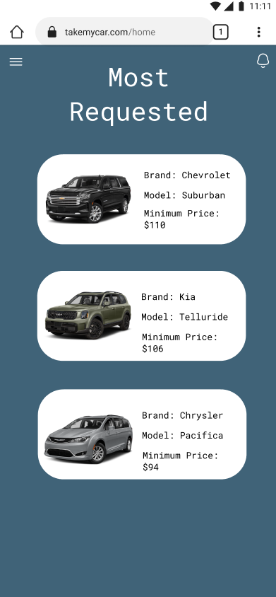

  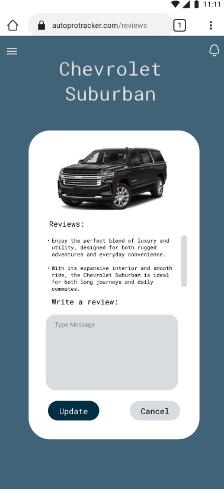

  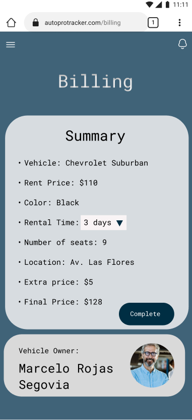

Aplicacion web Escritorio:

  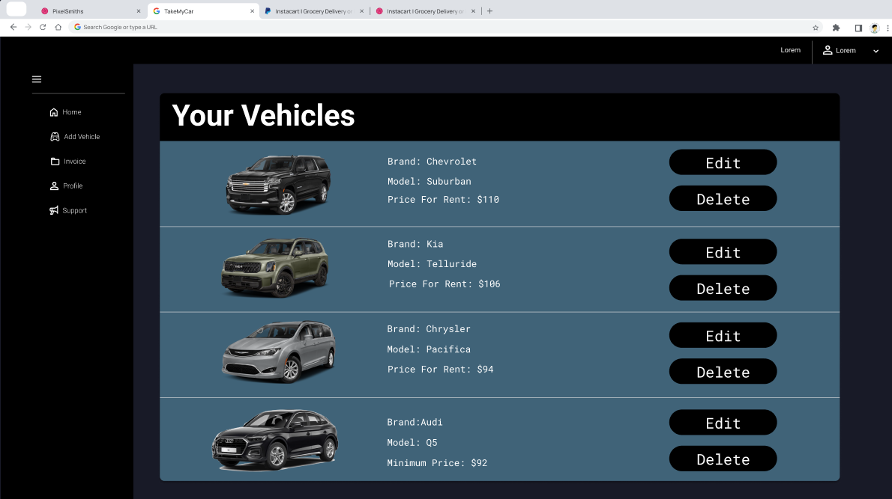

  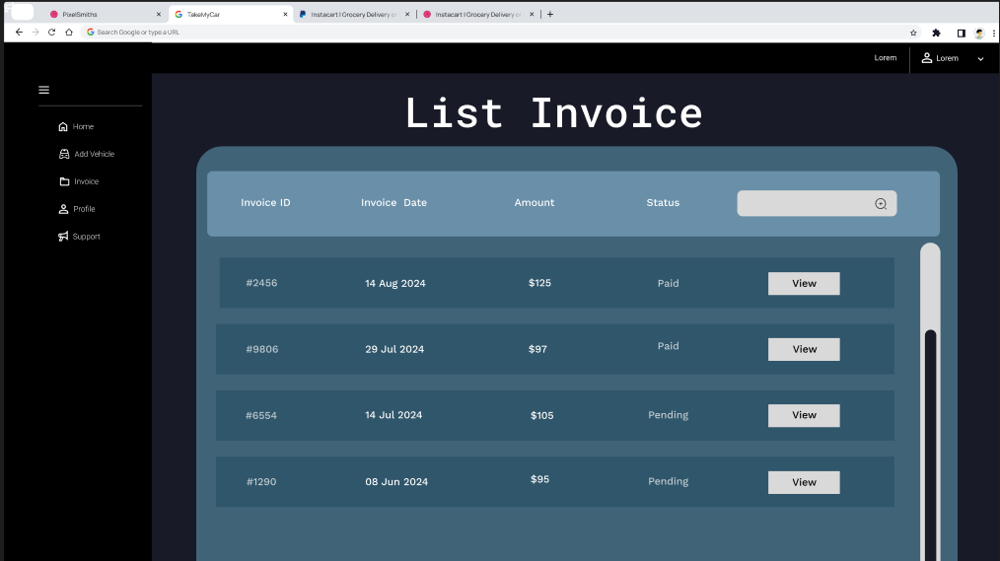

  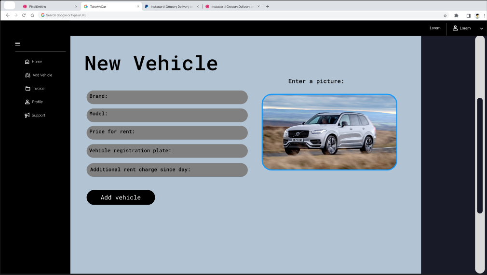

### 4.2.3. SEO Tags and Meta Tag
A continuación, mostraremos las etiquetas que representarán el contenido presentado tanto en nuestra aplicación web como en nuestra página de inicio. Estas etiquetas facilitarán la identificación y localización de TakeMyCar.

Landing Page:

Title: TakeMyCar

Description: TakeMyCar - Oficial Landing Page

Keywords: Vehicles, Subscription, Rates.

Authors: TakeMyCar team

Web application:

Title: TakeMyCar

Description: TakeMyCar - Oficial Web Site

Keywords: Vehicles, Brands, Prices, Rent, Locations.

Authors: TakeMyCar team

### 4.2.4. Searching Systems
Se implementaron dos funcionalidades de búsqueda similares con el objetivo de mejorar la experiencia de usuario al facilitar la búsqueda de información deseada.

El primero de estos sistemas se encuentra en la sección de "Vehicles" de la aplicación. Aquí, los usuarios tienen acceso a una lista completa de todas los vehiculos disponibles. Para agilizar la localización de vehiculos con la posiblidad de aplicar filtros, demás de la incorporación de una barra de búsqueda que permite introducir términos clave para encontrar rápidamente una marca o módelo.

Por otro lado, el segundo sistema de búsqueda se encuentra en la sección de "Locations". En esta sección, los usuarios pueden de entre todas las posibles ubicación ya sea para el lugar de recogida o despacho. Además de la búsqueda por ciudad, se han implementado filtros adicionales que permiten refinar la búsqueda según la cercanía y disponibilidad de horario. Esta funcionalidad proporciona a los usuarios una experiencia más amigable y facilita su interacción con la aplicación.

4.2.5. Navigation Systems
Para facilitar la navegación del usuario dentro de la aplicación, proporcionamos un menú desplegable intuitivo que le permite moverse entre las distintas áreas de la misma:

En el caso de los usuarios que tienen la necesidad de alquilar un vehículo.

- Home: Página de inicio del menú con los vehiculos más populares.

- Search: Acceso a información de los vehiculos.

- Profile: Visualización de datos personales.

- History: Visualización del historias de vehiculos rentados.

- Configuration: Configuración de la aplicación.

- Support: Solicitud de ayuda en caso de errores.

Para los propietarios de uno o más vehículos propios, el menú es similar, pero con algunos cambios secciones adicionales:

- Home: Página de inicio del menú con los vehiculos ingresados a la pagina.

- AddVehicle: Lista de vehiculos donde se puede agregar un nuevo vehiculo para que sea arrendado.

- Invoice: Administración de las facturas emitidas detallando datos del vehiculo y el tiempo que ha sido rentado.

- Profile: Visualización de datos personales.

- Configuration: Configuración de la aplicación.

- Support: Solicitud de ayuda en caso de errores.

Adicionalmente, nos aseguramos de que la aplicación sea fácil de leer para que el usuario no se sienta perdido con lo que tiene en pantalla. Esto permite que pueda realizar acciones que lo llevan a otras ventanas de forma intuitiva.

## 4.3. Landing Page UI Design

### 4.3.1 Landing Page Wireframe.

<b>Página Principal</b>

  

<b>¿Qué Ofrecemos?</b>

  

<b>Sobre Nosotros</b>

  

<b>Contactanos</b>

  

### 4.3.2. Landing Page Mock-up.
Tomando en cuenta los Wireframes, adoptado una estructura uniforme para todas las páginas, integrando la paleta de colores, tipografía otros recursos ya preseleccionados.

Inicio:

  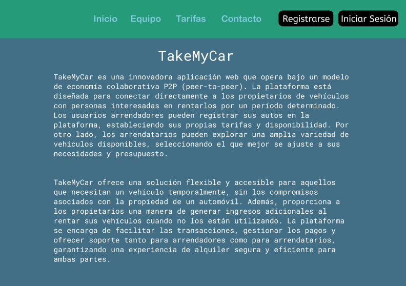

Equipo:

  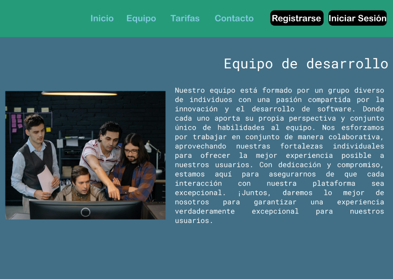

Tarifas:

  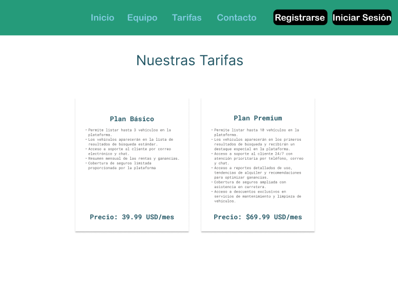

Contacto:

  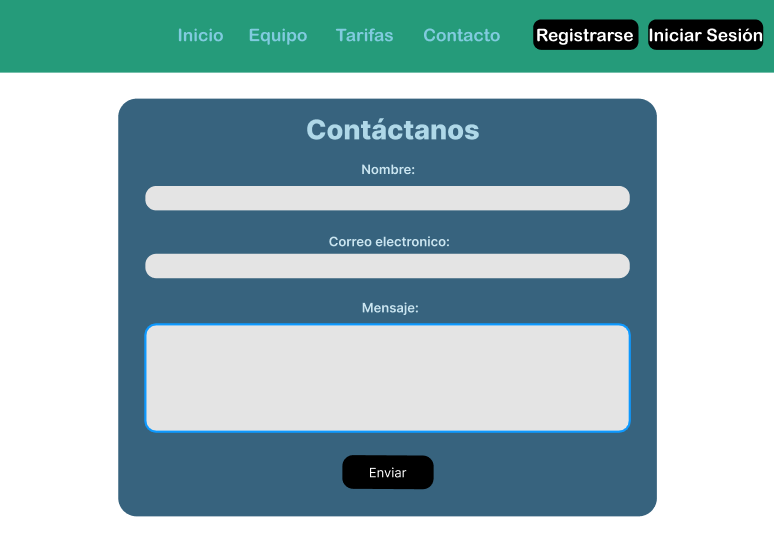

## 4.4. Web Applications UX/UI Design

Link Figma : https://www.figma.com/design/IJfwgFrR0vsiqOXYDn6wkZ/Web-Application-PixelSmiths?node-id=207-8737&t=vF3XfAgs62TSKFmu-1

### 4.4.1. Web Applications Wireframes

Tomando en cuenta nuestras entrevistas para el segmento de propietarios de uno o más vehículos propios, se prefiere un entorno de escritorio en el que hemos integrado funcionalidades como la gestión de vehiculos, añadir vehiculos, la administración de facturas de alquileres y la modificación del perfil.

  

  

  

Por otro lado, para el segmento de usuarios que tienen la necesidad de alquilar un vehículo, se prefiere un entorno movil en el que hemos integrado funcionalidades como la visualización de los vehiculos más populares, la busqueda con los filtros, historial y el perfil.

  

  

  

### 4.4.2. Web Applications Wireflow Diagrams

Propietarios de uno o más vehículos propios:

### 4.4.3. Web Applications Mock-ups
### 4.4.4. Web Applications User Flow Diagrams
## 4.5. Web Applications Prototyping
## 4.6. Domain-Driven Software Architecture
Para la construcción de los diagramas, se utilizó la herramienta Structurizr.

### 4.6.1. Software Architecture Context Diagram

  

Elementos del diagrama:

  

### 4.6.2. Software Architecture Container Diagrams

  

Elementos del diagrama:

  

### 4.6.3. Software Architecture Components Diagrams

  

Elementos del diagrama:

  

## 4.7. Software Object-Oriented Design

En este capitulo veremos el diseño de nuestros "objetos". Estos objetos representan entidades o conceptos del mundo real que tienen tanto datos (atributos) como comportamientos (métodos). Este enfoque facilita la construcción de software complejo mediante la división del problema en componentes más pequeños y manejables que interactúan entre sí de manera predecible y estructurada.

### 4.7.1. Class Diagrams

En este diagrama de clases se muestran las clases que componen la aplicación TakeMyCar.

### 4.7.2. Class Dictionary

En este apartado detallamos cada clase de nuestro diagrama

 

    <h3>User Class</h3>
    <table>
      <thead>
          <tr>
              <th>Attribute</th>
              <th>Type</th>
              <th>Description</th>
          </tr>
      </thead>
      <tbody>
          <tr>
              <td>userID</td>
              <td>string</td>
              <td>Identificador único del usuario</td>
          </tr>
          <tr>
              <td>nombre</td>
              <td>string</td>
              <td>Nombre del usuario</td>
          </tr>
          <tr>
              <td>email</td>
              <td>string</td>
              <td>Correo electrónico del usuario</td>
          </tr>
          <tr>
              <td>password</td>
              <td>string</td>
              <td>Contraseña del usuario</td>
          </tr>  
          <tr>
              <td>direccion</td>
              <td>string</td>
              <td>Dirección del usuario</td>
          </tr>
          <tr>
              <td>telefono</td>
              <td>string</td>
              <td>Telefono del usuario</td>
          </tr> 
          <tr>
              <td>FechaRegistro</td>
              <td>date</td>
              <td>Fecha de Registro del usuario</td>
          </tr>
        <tr>
              <td>TipoUsuario</td>
              <td>list</td>
              <td>Tipo de usuario</td>
          </tr>
      </tbody>
    </table>
    <h3>Vehiculo Class</h3>
    <table>
      <thead>
          <tr>
              <th>Attribute</th>
              <th>Type</th>
              <th>Description</th>
          </tr>
      </thead>
      <tbody>
          <tr>
              <td>vehicleid</td>
              <td>int</td>
              <td>Identificador único del vehiculo</td>
          </tr>
          <tr>
              <td>marca</td>
              <td>string</td>
              <td>Marca del vehiculo</td>
          </tr>
          <tr>
              <td>modelo</td>
              <td>string</td>
              <td>Modelo del vehiculo</td>
          </tr>
          <tr>
              <td>anno</td>
              <td>int</td>
              <td>Año del vehiculo</td>
          </tr>
          <tr>
              <td>placa</td>
              <td>string</td>
              <td>Placa del vehiculo</td>
          </tr>
          <tr>
              <td>color</td>
              <td>string</td>
              <td>Color del vehiculo</td>
          </tr>
          <tr>
              <td>kilometraje</td>
              <td>float</td>
              <td>Kilometraje del vehiculo</td>
          </tr>
          <tr>
              <td>precioXdia</td>
              <td>float</td>
              <td>Precio por dia del vehiculo</td>
          </tr>
          <tr>
              <td>estado</td>
              <td>list</td>
              <td>Estado del vehiculo</td>
          </tr>
          <tr>
              <td>propietarioID</td>
              <td>string</td>
              <td>Id del Propietario del vehiculo</td>
          </tr>
      </tbody>
    </table>
    <h3>Reserva class</h3>
    <table>
      <thead>
          <tr>
              <th>Attribute</th>
              <th>Type</th>
              <th>Description</th>
          </tr>
      </thead>
      <tbody>
          <tr>
              <td>bookingid</td>
              <td>int</td>
              <td>Identificador único de la reserva</td>
          </tr>
          <tr>
              <td>vehicleID</td>
              <td>int</td>
              <td>Identificardo de cada vehiculo</td>
          </tr>
          <tr>
              <td>arrendatarioID</td>
              <td>string</td>
              <td>Identificador de cada usuario arrendatario</td>
          </tr>
          <tr>
              <td>fechaInicio</td>
              <td>date</td>
              <td>Fecha de inicio de cada reserva</td>
          </tr>
          <tr>
              <td>fechaFin</td>
              <td>date</td>
              <td>Fecha de fin de cada reserva</td>
          </tr>
          <tr>
              <td>estadoReserva</td>
              <td>int</td>
              <td>Estado de cada reserva</td>
          </tr>
          <tr>
              <td>precioTotal</td>
              <td>float</td>
              <td>Precio de cada reserva</td>
          </tr>
      </tbody>
    </table>
    <h3>Pago class</h3>
    <table>
      <thead>
          <tr>
              <th>Attribute</th>
              <th>Type</th>
              <th>Description</th>
          </tr>
      </thead>
      <tbody>
        <tr>
            <td>paymentID</td>
            <td>int</td>
            <td>Identificador único de los pagos</td>
        </tr>
        <tr>
            <td>bookingID</td>
            <td>Booking</td>
            <td>Identificador de las reservas</td>
        </tr>
        <tr>
            <td>monto</td>
            <td>float</td>
            <td>Monto de cada reserva</td>
        </tr>
        <tr>
            <td>fechaPago</td>
            <td>date</td>
            <td>Fecha de la pago de una reserva</td>
        </tr>
        <tr>
            <td>metoddoPago</td>
            <td>list</td>
            <td>metodo de pago de cada reserva</td>
        </tr>
        <tr>
            <td>estadoPago</td>
            <td>list</td>
            <td>Estado de pago dla reserva</td>
        </tr>
      </tbody>
    </table>
    <h3>Review Class</h3>
    <table>
      <thead>
          <tr>
              <th>Attribute</th>
              <th>Type</th>
              <th>Description</th>
          </tr>
      </thead>
      <tbody>
        <tr>
            <td>reviewID</td>
            <td>int</td>
            <td>Identificador de las reseñas</td>
        </tr>
        <tr>
            <td>bookingID</td>
            <td>Booking</td>
            <td>Reserva observada</td>
        </tr>
        <tr>
            <td>autorID</td>
            <td>User</td>
            <td>Usuario relacionado</td>
        </tr>
        <tr>
            <td>calificacion</td>
            <td>int</td>
            <td></td>
        </tr>
        <tr>
            <td>comentario</td>
            <td>string</td>
            <td></td>
        </tr>
        <tr>
            <td>fechaResenna</td>
            <td>string</td>
            <td></td>
        </tr>
      </tbody>
    </table>
    <h3>Mensaje class</h3>
      <table>
        <thead>
            <tr>
                <th>Attribute</th>
                <th>Type</th>
                <th>Description</th>
            </tr>
        </thead>
        <tbody>
          <tr>
              <td>nessageID</td>
              <td>int</td>
              <td>Identificador único de cada mensaje</td>
          </tr>
          <tr>
              <td>senderID</td>
              <td>User</td>
              <td>Usuario que envia un mensaje</td>
          </tr>
          <tr>
              <td>receiverID</td>
              <td>User</td>
              <td>Usuario que recibe un mensaje</td>
          </tr>
          <tr>
              <td>contenido</td>
              <td>string</td>
              <td>Fecha del recordatorio</td>
          </tr>
          <tr>
              <td>fechaEnvio</td>
              <td>date</td>
              <td>Fecha del recordatorio</td>
          </tr>
        </tbody>
      </table>
    <h3>Subscription class</h3>
    <table>
      <thead>
          <tr>
              <th>Attribute</th>
              <th>Type</th>
              <th>Description</th>
          </tr>
      </thead>
    <tbody>
        <tr>
            <td>id</td>
            <td>int</td>
            <td>Identifica la suscripción</td>
        </tr>
        <tr>
            <td>paymet_code</td>
            <td>string</td>
            <td>Codigo generado por el sistema paymet para la validacion del pago</td>
        </tr>
        <tr>
          <td>Expire_date</td>
          <td>date</td>
          <td>Fecha de expiración de la suscripción</td>
        </tr>
    </tbody>
  </table>
  

## 4.8. Database Design
### 4.8.1. Database Diagram
# Capítulo V: Product Implementation, Validation & Deployment
## 5.1. Software Configuration Management
### 5.1.1. Software Development Environment Configuration

### 5.1.2. Source Code Management

### 5.1.3. Source Code Style Guide & Conventions

### 5.1.4. Software Deployment Configuration

## 5.2. Landing Page, Services & Applications Implementation
### 5.2.1. Sprint 1
#### 5.2.1.1. Sprint Planning 1

#### 5.2.1.2. Sprint Backlog 1

#### 5.2.1.3. Development Evidence for Sprint Review

#### 5.2.1.4. Testing Suite Evidence for Sprint Review

#### 5.2.1.5. Execution Evidence for Sprint Review

#### 5.2.1.6. Services Documentation Evidence for Sprint Review

#### 5.2.1.7. Software Deployment Evidence for Sprint Review

#### 5.2.1.8. Team Collaboration Insights during Sprint

# Conclusiones
### Conclusiones y recomendaciones
### Video About-the-Team

---
# Bibliografía

---
# Anexos
