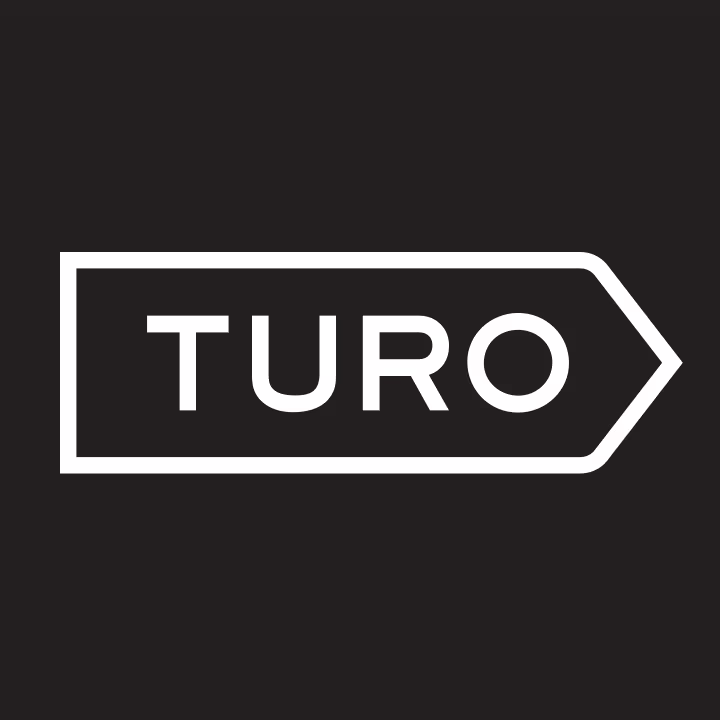
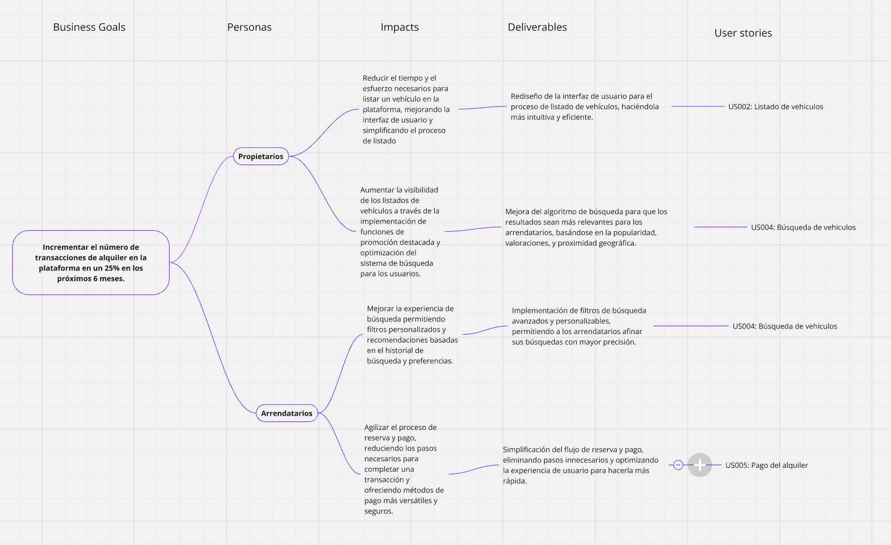
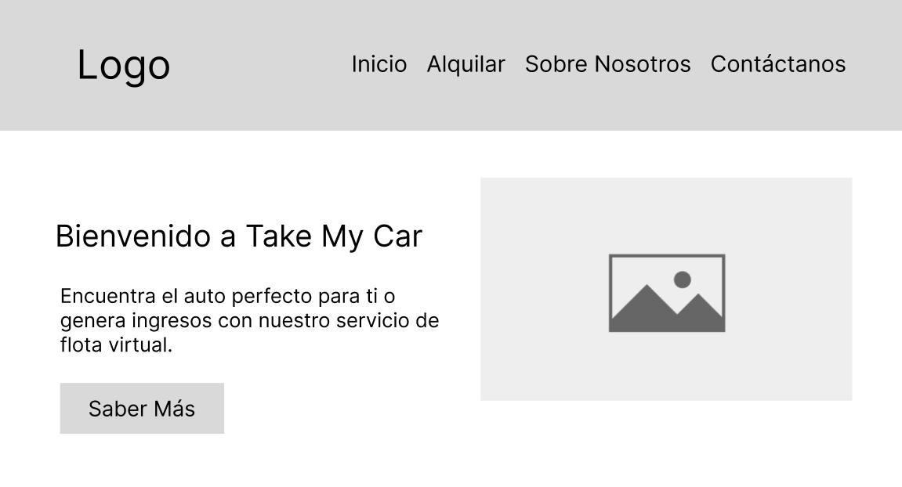
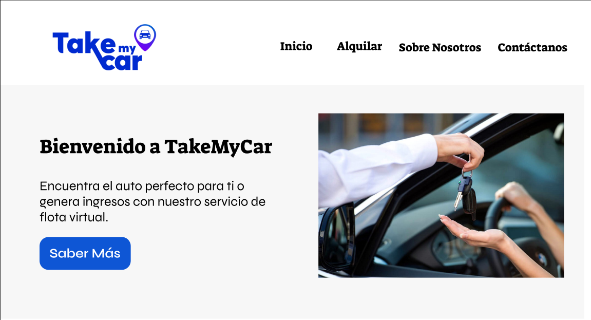

  

# Universidad Peruana de Ciencias Aplicadas

## Carrera de Ingeniería de Software

Ciclo: 2024 - 02

Curso: Desarrollo de Aplicaciones Open Source

Sección: SW54

Profesor: Alberto Wilmer Sanchez Seña

Informe del Trabajo Final

Startup: PixelSmiths

Producto: TakeMyCar

|          Integrantes           |   Código   |
| :----------------------------: | :--------: |
|      Ramos Carpio, Karen       | U20201E493 |
|      Arce Huaman Luis Andres   | U20201A300 |
|      Ramos Huamanchumo, Javier | U201719648 |
|      Pinto Fuentes Rivera, Alvaro Felipe | U202213384 |
|      Cruz Ticona, Aaron Alejandro | U202213502 |

Agosto del 2024

 
 
 
 
 
 
 
 
 

# Registro de Versiones del Informe

<table>
  <thead>
    <tr>
        <th>Versión</th>
        <th>Fecha</th>
        <th>Autor</th>
        <th>Descripción de modificación</th>
    </tr>
  </thead>
  <tbody>
  <tr>
      <td><strong>TB1</strong></td>
      <td>Viernes 06 de Setiembre</td>
      <td>
        <ul>
          <li>Ramos Carpio, Karen</li>
          <li>Arce Huaman, Luis Andres</li>
          <li>Pinto Fuentes Rivera, Alvaro Felipe</li>
          <li>Cruz Ticona, Aaron Alejandro</li>
          <li>Ramos Huamanchumo, Javier</li>
        </ul>
      </td>
      <td>
        Se han incluído los siguientes capítulos:
        <ul>
          <li>Capítulo I: Introducción</li>
          <li>Capítulo II: Requirements Elicitation & Analysis</li>
          <li>Capítulo III: Requirements Specification</li>
          <li>Capítulo IV: Product Design</li>
          <li>Avance del Capítulo V: Product Implementation, Validation & Deployment hasta el punto 5.2.1.8</li>
          <li>Avance de Conclusiones, Bibliografía y Anexos</li>
        </ul>
      </td>
  </tr>
  </tbody>
</table>

 
 
 
 
 
 
 
 
 
 
 
 
 

# Student Outcome

<table style="border-collapse: collapse; width: 100%; border: 1px solid black;">
  <thead>
    <tr style="border-bottom: 1px solid black;">
      <th style="border-right: 1px solid black;">Criterio Específico</th>
      <th style="border-right: 1px solid black;">Acciones Realizadas</th>
      <th>Conclusiones</th>
    </tr>
  </thead>
  <tbody>
    <tr style="border-bottom: 1px solid black;">
      <td style="border-right: 1px solid black;"><strong>Comunica en forma escrita ideas y/o resultados con objetividad a público de diferentes especialidades y niveles jerárquicos, en el marco del desarrollo de un proyecto en ingeniería</strong></td>
      <td style="border-right: 1px solid black;">
        <ul>
          
<strong>TB1</strong>

          <li>Ramos Carpio, Karen:</li>
          <li>Arce Huaman, Luis Andres:</li>
          <li>Pinto Fuentes Rivera, Alvaro Felipe:</li>
          <li>Cruz Ticona, Aaron Alejandro:</li>
          <li>Ramos Huamanchumo, Javier: </li>
        </ul> 
      <td><strong>TB1:</strong>
Se logró realizar un trabajo sobresaliente, cumpliendo con todos los segmentos del trabajo y entregando un documento que sirve como sustento escrito para comprender los pasos seguidos en la planificación, desarrollo y envío del proyecto a producción.

       
    </tr>
    <tr style="border-bottom: 1px solid black;">
      <td style="border-right: 1px solid black;"><strong>Comunica oralmente sus ideas y/o resultados con objetividad a público de diferentes especialidades y niveles jerárquicos, en el marco del desarrollo de un proyecto en ingeniería</strong></td>
      <td style="border-right: 1px solid black;">
        <ul>
          
<strong>TB1</strong>

          <li>Ramos Carpio, Karen:</li>
          <li>Arce Huaman, Luis Andres:</li>
          <li>Pinto Fuentes Rivera, Alvaro Felipe:</li>
          <li>Cruz Ticona, Aaron Alejandro:</li>
          <li>Ramos Huamanchumo, Javier: </li>
        </ul> 
      </td>
      <td>
<strong>TB1</strong>

        
El equipo estableció medios de comunicación efectivos para entregar un trabajo completo dentro de los cortos períodos de tiempo para la entrega del proyecto. Además, se comunicaron los resultados obtenidos a los stakeholders, quienes demostraron su satisfacción con el programa. Cada miembro realizó presentaciones detalladas de sus avances y colaboró en la comunicación constante con los segmentos objetivo y clientes.

         
    </tr>
  </tbody>
</table>

# **Project Report Online**

URL Project Report (Github): https://github.com/G1-UPC-PRE-SI729-2402-SW54-PixelSmiths
          
# Contenido
## Tabla de contenidos

### [Capítulo I: Introducción](#capítulo-i-introducción-1)
- [1.1. Startup Profile]()
    - [1.1.1 Descripción de la Startup]()
    - [1.1.2 Perfiles de integrantes del equipo]()
- [1.2 Solution Profile]()
    - [1.2.1 Antecedentes y problemática]()
    - [1.2.2 Lean UX Process]()
        - [1.2.2.1. Lean UX Problem Statements]()
        - [1.2.2.2. Lean UX Assumptions]()
        - [1.2.2.3. Lean UX Hypothesis Statements]()
        - [1.2.2.4. Lean UX Canvas]()
- [1.3. Segmentos objetivo]()

### [Capítulo II: Requirements Elicitation & Analysis](#capítulo-ii-requirements-elicitation--analysis-1)
- [2.1. Competidores]()
    - [2.1.1. Análisis competitivo]()
    - [2.1.2. Estrategias y tácticas frente a competidores]()
- [2.2. Entrevistas]()
    - [2.2.1. Diseño de entrevistas]()
    - [2.2.2. Registro de entrevistas]()
    - [2.2.3. Análisis de entrevistas]()
- [2.3. Needfinding]()
    - [2.3.1. User Personas]()
    - [2.3.2. User Task Matrix]()
    - [2.3.3. User Journey Mapping]()
    - [2.3.4. Empathy Mapping]()
    - [2.3.5. As-is Scenario Mapping]()
- [2.4. Ubiquitous Language]()

### [Capítulo III: Requirements Specification](#capítulo-iii-requirements-specification-1)
- [3.1. To-Be Scenario Mapping](#31-to-be-scenario-mapping)
- [3.2. User Stories](#32-user-stories)
- [3.3. Impact Mapping](#33-impact-mapping)
- [3.4. Product Backlog](#34-product-backlog)

### [Capítulo IV: Product Design](#capítulo-iv-product-design-1)
- [4.1. Style Guidelines]()
    - [4.1.1. General Style Guidelines]()
    - [4.1.2. Web Style Guidelines]()
- [4.2. Information Architecture]()
    - [4.2.1. Organization Systems]()
    - [4.2.2. Labeling Systems]()
    - [4.2.3. SEO Tags and Meta Tags]()
    - [4.2.4. Searching Systems]()
    - [4.2.5. Navigation Systems]()
- [4.3. Landing Page UI Design]()
    - [4.3.1. Landing Page Wireframe]()
    - [4.3.2. Landing Page Mock-up]()
- [4.4. Web Applications UX/UI Design]()
    - [4.4.1. Web Applications Wireframes]()
    - [4.4.2. Web Applications Wireflow Diagrams]()
    - [4.4.3. Web Applications Mock-ups]()
    - [4.4.4. Web Applications User Flow Diagrams]()
- [4.5. Web Applications Prototyping]()
- [4.6. Domain-Driven Software Architecture]()
    - [4.6.1. Software Architecture Context Diagram]()
    - [4.6.2. Software Architecture Container Diagrams]()
    - [4.6.3. Software Architecture Components Diagrams]()
- [4.7. Software Object-Oriented Design]()
    - [4.7.1. Class Diagrams]()
    - [4.7.2. Class Dictionary]()
- [4.8. Database Design]()
    - [4.8.1. Database Diagram]()

### [Capítulo V: Product Implementation, Validation & Deployment](#capítulo-v-product-implementation-validation--deployment-1)
- [5.1. Software Configuration Management]()
    - [5.1.1. Software Development Environment Configuration]()
    - [5.1.2. Source Code Management]()
    - [5.1.3. Source Code Style Guide & Conventions]()
    - [5.1.4. Software Deployment Configuration]()
- [5.2. Landing Page, Services & Applications Implementation]()
    - [5.2.1. Sprint 1]()
        - [5.2.1.1. Sprint Planning 1]()
        - [5.2.1.2. Sprint Backlog 1]()
        - [5.2.1.3. Development Evidence for Sprint Review]()
        - [5.2.1.4. Testing Suite Evidence for Sprint Review]()
        - [5.2.1.5. Execution Evidence for Sprint Review]()
        - [5.2.1.6. Services Documentation Evidence for Sprint Review]()
        - [5.2.1.7. Software Deployment Evidence for Sprint Review]()
        - [5.2.1.8. Team Collaboration Insights during Sprint]()
    - [5.2.2. Sprint 2]()
        - [5.2.2.1. Sprint Planning 2]()
        - [5.2.2.2. Sprint Backlog 2]()
        - [5.2.2.3. Development Evidence for Sprint Review]()
        - [5.2.2.4. Testing Suite Evidence for Sprint Review]()
        - [5.2.2.5. Execution Evidence for Sprint Review]()
        - [5.2.2.6. Services Documentation Evidence for Sprint Review]()
        - [5.2.2.7. Software Deployment Evidence for Sprint Review]()
        - [5.2.2.8. Team Collaboration Insights during Sprint]()
    - [5.2.3. Sprint 3]()
        - [5.2.3.1. Sprint Planning 3]()
        - [5.2.3.2. Sprint Backlog 3]()
        - [5.2.3.3. Development Evidence for Sprint Review]()
        - [5.2.3.4. Testing Suite Evidence for Sprint Review]()
        - [5.2.3.5. Execution Evidence for Sprint Review]()
        - [5.2.3.6. Services Documentation Evidence for Sprint Review]()
        - [5.2.3.7. Software Deployment Evidence for Sprint Review]()
        - [5.2.3.8. Team Collaboration Insights during Sprint]()
    - [5.2.4. Sprint 4]()
        - [5.2.4.1. Sprint Planning 4]()
        - [5.2.4.2. Sprint Backlog 4]()
        - [5.2.4.3. Development Evidence for Sprint Review]()
        - [5.2.4.4. Testing Suite Evidence for Sprint Review]()
        - [5.2.4.5. Execution Evidence for Sprint Review]()
        - [5.2.4.6. Services Documentation Evidence for Sprint Review]()
        - [5.2.4.7. Software Deployment Evidence for Sprint Review]()
        - [5.2.4.8. Team Collaboration Insights during Sprint]()
- [5.3. Validation Interviews]()
    - [5.3.1. Diseño de Entrevistas]()
    - [5.3.2. Registro de Entrevistas]()
    - [5.3.3. Evaluaciones según heurísticas]()
- [5.4. Video About-the-Product]()

---
# Capítulo I: Introducción
## 1.1. Startup Profile
### 1.1.1 Descripción de la Startup

TakeMyCar es una startup que actua como intermediario entre propietarios e interesando en el uso de un vehiculo. Nuestra plataforma integra una interfaz eficiente, donde los clientes puede contactarnos tanto para ofrecernos su auto, como para el alquiler de alguno ya catalogado y exhibido en nuestra plataforma. Nuestro modelo de negocio es p2p, y contamos con la ventaja de que no tendremos la necesidad de invertir en una flota inicial de vehiculos, ya que dependera exclusivamente de la demanda encontrada en nuestro mercado, generando asi beneficios a ambos segmenos objetivos. En este trabajo veremos esta startup desarrollarse y poder plasmar el potencial de la misma.

Misión: Facilitar el acceso a vehículos compartidos mediante una plataforma digital que permita a las personas alquilar autos de otros propietarios, Buscando aprovechar la tecnología para ofrecer una alternativa más eficiente y sostenible al modelo tradicional de propiedad de vehículos, reduciendo la necesidad de tener un auto propio y promoviendo un uso más eficiente de los recursos.

Visión: Crear un mundo donde el acceso a la movilidad sea sencillo y compartido, disminuyendo la cantidad de autos en circulación, contribuyendo a ciudades más limpias y sostenibles, y mejorando la eficiencia del transporte mediante la economía colaborativa.

Logotipo de la Startup:

 

Logotipo del servicio:

 

### 1.1.2 Perfiles de integrantes del equipo

<table>
  <tr align="center">
    <td rowspan="4">
      
    </td>
    <td align="left">
      <b>Nombre y Apellido:</b>
                   
      Aaron Alejandro Cruz Ticona
    </td>
  </tr>
  <tr>
    <td align="left">
    <b>Código:</b>
     
    U202213502
    </td>
  </tr>
  <tr>
    <td align="left">
    <b>Carrera:</b>
     
    Ingeniería de Software
    </td>
  </tr>
  <tr>
    <td align="left">
    <b>Acerca de:</b>
     
    Me llamo Aaron Cruz, me encuentro inmerso en la carrera de Ingenieria de Software. Hablando de mi, me considero una persona curiosa, lo que me lleva a tener constante interes en el aprender nuevas cosas y espero hacerlo en este curso.
    </td>
  </tr>

  <tr align="center">
    <td rowspan="4">
      
    </td>
    <td align="left">
      <b>Nombre y Apellido:</b>
                   
      Karen Ramos Carpio
    </td>
  </tr>
  <tr>
    <td align="left">
    <b>Código:</b>
     
    U20201e493
    </td>
  </tr>
  <tr>
    <td align="left">
    <b>Carrera:</b>
     
    Ingeniería de Software
    </td>
  </tr>
  <tr>
    <td align="left">
    <b>Acerca de:</b>
     
    Cuento con gran capacidad de autoaprendizaje, esto me permite alcanzar mejores índices de productividad para la empresa de forma individual como en trabajo en equipo       para poder llegar a los objetivos definidos por la empresa.Tengo un alto sentido del compromiso y la responsabilidad por lo que puedo garantizar que la tarea que me        sea asignada será gestionada con diligencia.
    </td>
  </tr>

   <tr align="center">
    <td rowspan="4">
      
    </td>
    <td align="left">
      <b>Nombre y Apellido:</b>
                   
      Alvaro Felipe Pinto Fuentes Rivera
    </td>
  </tr>
  <tr>
    <td align="left">
    <b>Código:</b>
     
    U202213384
    </td>
  </tr>
  <tr>
    <td align="left">
    <b>Carrera:</b>
     
    Ingeniería de Software
    </td>
  </tr>
  <tr>
    <td align="left">
    <b>Acerca de:</b>
     
    Hola, mi nombre es Alvaro, soy un estudiante del quinto ciclo de la carrera Ingeniería de Software. Me gusta mucho leer, sobretodo el género de fantasía y ciencia ficción, mi frase favorita de un libro es el credo "Vida antes que muerte, fuerza antes que debilidad y viaje antes que destino", también soy un gran fan del cine y pasó la mayor parte de mi tiempo libre escribiendo por diversión. Poseo un nivel bueno de programación en los lenguajes de C# y C++, creo que podré resultar de gran ayuda para resolver cualquier tipo de problema durante el desarrollo del proyecto, así como podré brindar ideas creativas para el equipo.	
  </tr>

   <tr align="center">
    <td rowspan="4">
      
    </td>
    <td align="left">
      <b>Nombre y Apellido:</b>
                   
      Javier Ramos
    </td>
  </tr>
  <tr>
    <td align="left">
    <b>Código:</b>
     
    U201719648
    </td>
  </tr>
  <tr>
    <td align="left">
    <b>Carrera:</b>
     
    Ingeniería de Sistemas
    </td>
  </tr>
  <tr>
    <td align="left">
    <b>Acerca de:</b>
     
    Mi nombre es Javier Ramos, actualmente me encuentro en el proceso de traslado hacia la carrera de Ingeniería de Software, ya que deseo formalizar mis conocimientos en el área que me apasiona y a la que me dedico laboralmente.
Tengo experiencia en AWS, diversas tecnologías frontend, backend y CMS. Además me encuentro certificado en Contentful y AWS
    </td>
  </tr>
   <tr align="center">
    <td rowspan="4">
      
    </td>
    <td align="left">
      <b>Nombre y Apellido:</b>
                   
      Luis Andres Arce Huaman
    </td>
  </tr>
  <tr>
    <td align="left">
    <b>Código:</b>
     
    U20201A300
    </td>
  </tr>
  <tr>
    <td align="left">
    <b>Carrera:</b>
     
    Ingeniería de software
    </td>
  </tr>
  <tr>
    <td align="left">
    <b>Acerca de:</b>
     
    Mi nombre es Andres y tengo 20 años , soy estudiante de la carrera de Ingeniería de Software. Mis principales hobbies son: ver películas , dibujar y hacer deporte. Me comprometo como miembro a aportar en la realización de las entregas correspondientes
    </td>
  </tr>

</table>

## 1.2 Solution Profile
### 1.2.1 Antecedentes y problemática

#### Antecedentes

Dentro de nuestro pais, la densidad de poblacion y las consecuencia del mismo genera un aumento significativo en la demanda de soluciones en cuanto a la movilidad temporal y flexible, por lo que, existe la necesidad de una plataforma que simplifique la gestion entre los propietarios y los arrendatarios para el alquiler de vehículos mediante una plataforma como la que planeamos ofrecer.

#### Problemática

El problema principal, a grandes rasgos, radica en la falta de plataformas que faciliten el alquiler de vehículos de manera eficiente entre propietarios y arrendatarios ha creado una barrera para aquellos que requieran dun automóvil de manera rápida y temporal. Lo que limita a los arrendatarios y perjudica a los propietarios al no poder rentabilizar sus vehículos, problematica que solventaremos mediante nuestro modelo p2p, titulado "TakeMyCar".

#### Técnica de las 5 'W's y 2' H's

**What?**

El problema que abarcamos, si bien es cierto, no resuelve alguno de alerta considerable, se busca solventar la necesidad de la personas por el uso de un vehiculo en distintas situaciones. 

**When?**

La problematica ocurre cuando los propietarios desean generar rentabilidad y los arrendatarios necesitan el uso de un auto por un corto periodo de tiempo.  El producto se utiliza cuando los propietarios nos otorgan sus vehiculos, y son catalogados dentro de nuestra plataforma.

**Where?**

Estas necesidad surgiran comunmente en las zonas urbanas donde existe una demanda por el uso de vehiculos, y en este caso, el alquiler de los mismos. Podemos mencionar las ciudades de alto trafico y extension considerable, aunque puede ser usado para todo tipo de necesidad.

**Who?**

Los involucrados son los propietarios de vehiculos que desean alquilar su auto y no tienen el tiempo ni la confianza en una plataforma para hacerlo. Y tambien, los arrendatarios que buscan alquilar un vehiculo rapido, eficiente y sin complicaciones.

**Why?**

Las causas principales de la necesidad en cuestion son:

- Activo sin uso, los vehiculos que no estan siendo usados ni aprovechados.
- Falta de una plataforma interactiva y confiable para el alquiler de vehiculos.
- Mercado poco explorado para la demanda existente

**How?**

Nuestros clientes utilizaran nuestra plataforma cuando necesitan reentabilizar su vehiculo o cuando necesitan acceder rapidamente a un vehiculo para un uso especifico.

**How much?**

Para los propietarios no va a existir un costo mas que el tiempo invertido en brindar toda la informacion necesaria para la catalogacion de su vehiculo dentro de nuestra plataforma.

Para los arrendatarios, ademas de su pago por alquiler no tendran costo adicional, ya que con la finalidad de brindar un servicio completo, todo se encontrara incluido dentro del pago del alquiler.

Por nuestra parte, ya se menciono que no vamos a requerir una inversion en una flota de vehiculos. Por lo que, solo necesitaremos costo en publicidad y desarrollo de nuestra plataforma.

### 1.2.2 Lean UX Process
#### 1.2.2.1 Lean UX Problem Statements

La idea central de TakeMyCar, surge debido a la necesidad de nuestros segmentos en busca de una opción innovadora aún no explotada en nuestro entorno. Nos encontramos dentro del sector del alquiler de vehículos, centrandonos principalmente en la falta de disponibilidad y en los costos otorgados por parte de las empresas de alquiler de vehículos. 

De la misma forma, lo que otras escasas empresas, las cuales buscan brindar el servicio de alquiler no logran abordar es el hecho de que no muchas de ellas poseen el modelo de no uso de autos que sean propios, es decir, TakeMyCar esta pensada para no tener que realizar una inversión considerable en la obtencion de autos propios. 

Nuestro producto sobrepasa este limite, ofreciendo un modelo tanto de entrada como de salida, recibiremos carros de propietarios y lo alquilaremos a usuarios, lo que abarca con la necesidad de un modelo más flexible, rentable y escalable que permita tanto a los propietarios como a los arrendatarios obtener un beneficio económico. 

Finalmente, podremos sentir el trabajo concluido cuando veamos un numero considerable y en aumento de propietarios que, compartan su rentibilidad con sus conocidos, y que tengamos disponibles un catalogo considerable de vehiculos que concuerden a la demanda presente.

#### 1.2.2.2 Lean UX Assumptions

#### Segmento de Usuarios:

#### ¿Quién es el usuario?
Nuestros usuarios son propietarios de vehículos que buscan monetizar sus activos sin la carga de gestionarlos y arrendatarios que desean opciones flexibles y accesibles para alquilar sin preocupaciones y a precios cómodos.

#### ¿Dónde encaja nuestro servicio? ¿En su trabajo o vida?
Nuestro producto se integra en la vida de los propietarios de vehículos que desean obtener ingresos adicionales de manera pasiva y en la vida de los arrendatarios que necesitan una solución conveniente y asequible para alquilar un vehículo sin los compromisos de la propiedad.

#### ¿Cuando y cómo es usado nuestro servicio?
Los propietarios nos contactaran principalmente para listar sus vehículos y monitorear sus ingresos, mientras que los arrendatarios la utilizarán cuando necesiten alquilar un vehículo para diversas ocasiones, como viajes, mudanzas o tareas cotidianas.

#### ¿Qué problemas tiene nuestro servicio?
Un posible desafío es asegurar la confianza y satisfacción de los propietarios de vehículos en cuanto a la seguridad y cuidado de sus activos, y garantizar que los arrendatarios encuentren la experiencia de alquiler simple, rápida y sin complicaciones.

#### Business Outcomes:

* Creemos que a nuestros clientes les interesaría una plataforma que les permita alquilar sus vehículos sin gestión operativa y a los arrendatarios les ofrecería una opción accesible y diversa de vehículos.

* Creemos que nuestro público objetivo incluye a propietarios de vehículos que desean monetizar su activo de manera pasiva y arrendatarios que buscan soluciones de alquiler convenientes y asequibles.

* Reconocemos que hay competidores en el mercado, pero creemos que podemos diferenciarnos proporcionando un servicio sin la necesidad de inversión inicial en flota, lo que nos permitirá ofrecer precios más competitivos y una experiencia de usuario optimizada.

* Creemos que debemos asegurar la calidad y confiabilidad de nuestra plataforma, implementando rigurosas pruebas y manteniendo una comunicación activa con nuestros usuarios para abordar cualquier problema o inquietud que pueda surgir.

#### 1.2.2.3 Lean UX Hypothesis Statements

1. Creemos que los propietarios de vehículos que buscan monetizar sus activos sin la necesidad de involucrar tiempo e inversión considerable, quienes nos contactaran mediante nuestra plataforma par obtener ingresos pasivos bajo una fuente segura.

2. Creemos que los arrendatarios que buscan opciones de alquiler de vehículos flexibles y accesibles preferirán nuestra plataforma por su facilidad de uso, precios competitivos, seguridad y confianza.

3. Creemos que ofrecer un modelo de negocio sin inversión inicial en flota (no poseer autos propios para su alquiler), nos va a permitir inversión en otras areas y mantener un precio plano el cual sera competitivo bajo distintas métricas, y así, atraer tanto a arrendadores como a arrendatarios.

#### 1.2.2.4 Lean UX Canvas

## 1.3. Segmentos objetivo

<h3> Segmento #1: Propietarios de uno o más vehículos propios</h3>

<b>Aspectos demográficos:</b>

<ul>
  <li> Sexo: Masculino y Femenino </li>
  <li> Edades: Entre 18 y 60 años </li>
  <li> Nivel Socioeconómico: Clases A, B y C (Clase alta, clase media alta y clase media) </li>
</ul>

<b>Aspectos geográficos:</b>

<ul>
  <li> Nacionalidad: Peruana </li>
  <li> Zona Geográfica de Residencia: Urbana </li>
  <li> Departamento: Lima Metropolitana </li>
</ul>

<b>Aspectos psicograficos:</b>

<ul>
  <li> Personas naturales o jurídicas que no utilicen con frecuencia su activo (vehículo). </li>
  <li> Personas que deseen obtener ingresos pasivos sin la necesidad de invertir un gran cantidad de su tiempo. </li>
  <li> Personas que no encuentran una manera rápida y confiable de alquilar sus vehículos. </li>
</ul>

 
<h3> Segmento #2: Usuarios que tienen la necesidad de alquilar un vehículo </h3>

<b>Aspectos demográficos:</b>

<ul>
  <li> Sexo: Masculo y Femenino </li>
  <li> Edades: Entre 18 y 50 años </li>
  <li> Nivel Socioeconómico: Clases A. B y C (Clase alta, clase media alta y clase media) </li>
</ul>

<b>Aspectos geográficos:</b>

<ul>
  <li> Nacionalidad: Peruana </li>
  <li> Zona Geográfica de Residencia: Urbana </li>
  <li> Departamento: Lima Metropolitana </li>
</ul>

<b>Aspectos psicograficos:</b>

<ul>
  <li> Usuarios que gasten demasiadas horas semanales dentro del tráfico y el transporte público. </li>
  <li> Personas que no tienen la posibilidad de adquirir un auto nuevo o seminuevo para ciertas ocasiones. </li>
  <li> Personas que necesitan un medio de transporte propio por un tiempo corto de uso. </li>
</ul>

  

# Capítulo II: Requirements Elicitation & Analysis
## 2.1 Competidores
<h2><li>Turo:</li></h2> 
Descripción: Turo es una plataforma de alquiler de vehículos que permite a los propietarios alquilar sus vehículos a personas que buscan una alternativa al alquiler de autos que se realiza de manera muy tradicional. Los propietarios pueden listar sus vehículos en la plataforma, establecer precios y recibir ingresos por el tiempo que sus vehículos son alquilados. Turo maneja la plataforma digital, el proceso de reservas y un seguro correspondiente.  
<h3><li>Modelo de negocio:</li></h3>  Turo opera un modelo de negocio peer-to-peer y cobra una comisión sobre cada transacción y ofrece seguros para los propietarios y arrendatarios. 
<h2><li>Getaround:</li></h2> 
Descripción: La plataforma Getaround permite a los usuarios alquilar vehículos por horas o días. Los propietarios pueden compartir sus vehículos cuando no los usan, mientras que los arrendatarios pueden acceder a un coche en su área a través de la aplicación Getaround. La empresa también ofrece seguros y servicios sobre la gestión del alquiler. 
<h3><li>Modelo de negocio:</li></h3>  Opera un modelo de negocio peer-to-peer. Getaround cobra una comisión sobre cada alquiler y se encarga de proporcionar seguros y otras garantías. 
<h2><li>SIXT</li></h2> 
Descripción:
SIXT es una empresa global de alquiler de vehículos con una fuerte presencia en Europa y Latinoamérica, que ofrece desde alquileres tradicionales hasta soluciones digitales propias de la empresa. Los usuarios pueden reservar, desbloquear, y pagar por el uso del vehículo, lo que lo hace muy competitivo en el mercado actual de movilidad 
<h3><li>Modelo de negocio:</li></h3> 
SIXT opera un modelo de negocio híbrido basado en Pay-per-Use, combinando la propiedad de flota con servicios de alquiler digital donde los usuarios pagan por el tiempo que utilizan el vehículo.  

### 2.1.1 Análisis competitivo
<table>
    <thead>
        <tr >
            <th colspan=6 style="text-align: center">
				<h2>
					Competitive Analisis Landscape
				</h2>
			</th>
        </tr>
    </thead>
    <tbody>
        <tr>
            <td colspan=2 rowspan=2 style="text-align: center" align="center">¿Por qué llevar a cabo este análisis?</td>
            <td colspan=4 style="text-align: center" align="center">¿Quiénes son nuestros principales competidores?</td>
        </tr>
		<tr>
            <td colspan=4 style="text-align: center" align="center">Gracias al análisis de la competencia, se logra comprender el entorno competitivo en el que operará nuestro producto. Esto proporciona una visión detallada de quienes son nuestros competidores directos e indirectos, logrando así, trazar 
 una estretegia sólida para alcanzar la máxima exposición de nuestro producto, llegando así a más posibles consumidores.</td>
        </tr>
		<tr>
			<td rowspan=3 style="text-align: center" align="center">Perfil</td>
			<td rowspan=2 style="text-align: center" align="center">Overview</td>
      <td style="text-align: center" align="center">TakeMyCar 

</td>
			<td style="text-align: center" align="center">Turo 

</td>
			<td style="text-align: center" align="center">Getaround

</td>
			<td style="text-align: center" align="center">SIXT 

</td>
		</tr>
		<tr>
<td style="text-align: center" align="center">Aplicativo de alquiler de vehículos creado por nuestra startup:Pixel Smiths. TakeMyCarofrece una manera segura y sencilla de listar sus vehículos, con la ventaja de no requerir ninguna inversión inicial. Además, los propietarios solo son remunerados cuando su vehículo es alquilado, reduciendo riesgos y asegurando una fuente de ingresos sin compromisos
</td>
			<td style="text-align: center" align="center">Aplicativo de alquiler de vehículos creado por la empresa RelayRides. actualmente llamada Turo Inc.Turo ofrece ingresos pasivos donde los propietarios se benefician de la visibilidad que proporciona una plataforma global, junto con seguros integrados que protegen sus activos durante los alquileres

</td>
			<td style="text-align: center" align="center"> Aplicativo de alquiler de vehículos creado por la empresa Getaround Inc.
Getaround genera ingresos pasivos al alquilar sus vehículos de manera flexible, incluso por horas. La plataforma facilita el proceso con tecnología de acceso remoto al vehículo, eliminando la necesidad de interacciones en persona y ofreciendo seguros para mayor tranquilidad

</td>
			<td style="text-align: center" align="center">
Aplicativo de alquiler de vehículos creado por la empresa de Sixt SE.
ofrece a sus clientes una experiencia de alquiler de vehículos premium, con acceso a una extensa flota de autos bien mantenidos y una variedad de opciones que van desde alquileres de corto plazo hasta soluciones de movilidad compartida. La empresa actualmente es líder global en renta de vehículos. 

</td>
		</tr>
		<tr>
			<td style="text-align: center" align="center">Ventaja Competitiva ¿Qué valor ofrecen a los clientes</td>
			<td style="text-align: center" align="center">TakeMyCarofrece una manera segura y sencilla de listar sus vehículos, con la ventaja de no requerir ninguna inversión inicial. Además, los propietarios solo son remunerados cuando su vehículo es alquilado, reduciendo riesgos y asegurando una fuente de ingresos sin compromisos

</td>
			<td style="text-align: center" align="center">Turo
ofrece ingresos pasivos donde los propietarios se benefician de la visibilidad que proporciona una plataforma global, junto con seguros integrados que protegen sus activos durante los alquileres
</td>
			<td style="text-align: center" align="center">Getaround genera ingresos pasivos al alquilar sus vehículos de manera flexible, incluso por horas. La plataforma facilita el proceso con tecnología de acceso remoto al vehículo, eliminando la necesidad de interacciones en persona y ofreciendo seguros para mayor tranquilidad</td>
			<td style="text-align: center" align="center">ofrece a sus clientes una experiencia de alquiler de vehículos premium, con acceso a una extensa flota de autos bien mantenidos y una variedad de opciones que van desde alquileres de corto plazo hasta soluciones de movilidad compartida. La empresa actualmente es líder global en renta de vehículos. </td>
		</tr>
		<tr>
			<td rowspan=2 style="text-align: center" align="center">Perfil del Marketing</td>
			<td style="text-align: center" align="center">Mercado Objetivo</td>
			<td style="text-align: center" align="center">Personas adultas con un vehículo y de edad comprendida entre 25 a 60 años con un claro manejo de un dispositivo móvil.</td>
			<td style="text-align: center" align="center">Personas adultas con un vehículo y de edad comprendida entre 22 años en adelante con un claro manejo de un dispositivo móvil.</td>
			<td style="text-align: center" align="center">Personas adultas con un vehículo y de edad comprendida entre 22 años en adelante con un claro manejo de un dispositivo móvil.</td>
			<td style="text-align: center" align="center">Personas adultas con un vehículo y de edad comprendida entre 22 años en adelante con un claro manejo de un dispositivo móvil.</td>
		</tr>
		<tr>
			<td style="text-align: center" align="center">Estrategias de Marketing</td>
			<td style="text-align: center" align="center"><ul><li>Uso de publicidad en redes sociales</li> <li>Recomendación de voz a voz</li> <li>Prueba gratis de 30 días del plan premium para lograr retención</li></ul> </td>
			<td style="text-align: center" align="center"><ul><li>Promoción de la app en su cuenta de Twitter</li></ul> </td>
			<td style="text-align: center" align="center"><ul><li>Presentación de referencias en su landing page</li> <li>Cuentas activas de Facebook y Twitter</li></ul> </td>
			<td style="text-align: center" align="center"><ul><li>Presentación en una landing page vistosa</li> <li>Fácil acceso a los contactos para invitar más personas</li> <li>Página de redes sociales</li></ul> </td>
		</tr>
		<tr>
			<td rowspan=3 style="text-align: center" align="center">Perfil del Producto</td>
			<td style="text-align: center" align="center">Productos & Servicios</td>
			<td style="text-align: center" align="center">Sitio web para el registro y uso de nuestro aplicativo</td>
			<td style="text-align: center" align="center">Aplicativo móvil para el uso de la solución</td>
			<td style="text-align: center" align="center">Aplicativo móvil para el uso de la solución</td>
			<td style="text-align: center" align="center">Aplicativo móvil para el uso de la solución</td>
		</tr>
		<tr>
			<td style="text-align: center" align="center">Precios & Costos</td>
			<td style="text-align: center" align="center"><ul><li>Suscripción de un mes - 9.90 soles</li> <li>Suscripción de un año - 29.90 soles</li> <li>Suscripción empresarial - 169.90 soles</li></ul> </td>
			<td style="text-align: center" align="center"><ul><li>Pase de un mes - 2.90 soles</li> <li>Suscripción de un año - 11.90 soles</li> <li>Pase de por vida - 39.90 soles</li></ul> </td>
			<td style="text-align: center" align="center"><ul><li>Suscripción de un mes - 12.90 soles</li> <li>Suscripción de un año - 35.90 soles</li></ul> </td>
			<td style="text-align: center" align="center"><ul><li>Suscripción de un mes - 19.90 soles</li> <li>Suscripción de un año - 149.90 soles</li></ul> </td>
		</tr>
		<tr>
			<td style="text-align: center" align="center">Canales de distribución (web/móvil)</td>
			<td style="text-align: center" align="center">Plataforma web</td>
			<td style="text-align: center" align="center">Plataforma móvil</td>
			<td style="text-align: center" align="center">Plataforma móvil</td>
			<td style="text-align: center" align="center">Plataforma móvil</td>
		</tr>
		<tr>
			<td rowspan=4 style="text-align: center" align="center">Análisis SWOT</td>
			<td style="text-align: center" align="center">Fortalezas</td>
			<td style="text-align: center" align="center"><ul><li>Canales de atención disponibles</li> <li>Cálculo automático de saldos</li> <li>Uso de etiquetas para categorizar y filtrar las transacciones</li></ul> </td>
			<td style="text-align: center" align="center"><ul><li>Funciona offline</li> <li>Se sincroniza de forma automática con nuestros amigos</li></ul> </td>
			<td style="text-align: center" align="center"><ul><li>Uso de imágenes como evidencia</li> <li>Uso de claves de color para mejor visualización</li></ul> </td>
			<td style="text-align: center" align="center"><ul><li>Integración con cuentas de banco para realizar los pagos dentro de la misma aplicación</li> <li>División en partes iguales o desiguales</li></ul> </td>
		</tr>
		<tr>
			<td style="text-align: center" align="center">Debilidades</td>
			<td style="text-align: center" align="center"><ul><li>Requiere de conección a internet</li> <li>No soporta muchos idiomas</li></ul> </td>
			<td style="text-align: center" align="center"><ul><li>El diseño es demasiado simple</li> <li>Carece de diferenciadores con la competencia</li> <li>Cobra por features que se encuentran gratis en otras aplicaciones</li></ul> </td>
			<td style="text-align: center" align="center"><ul><li>La interfaz no es fácil de usar</li> <li>Cobra por features que se encuentran gratis en otras aplicaciones</li></ul> </td>
			<td style="text-align: center" align="center"><ul><li>Te da una cantidad de gastos limitados en el plan gratuito</li> <li>Los planes premium son demasiado costosos</li></ul> </td>
		</tr>
		<tr>
			<td style="text-align: center" align="center">Oportunidades</td>
			<td style="text-align: center" align="center"><ul><li>Es posible agregar más funcionalidades</li> <li>Ya se está empezando a crear un mercado gracias a las otras apps</li></ul> </td>
			<td style="text-align: center" align="center">Se puede agregar un poco más de profundidad al diseño</td>
			<td style="text-align: center" align="center">Se puede mejorar la interfaz para que sea más intuitiva</td>
			<td style="text-align: center" align="center">Es la aplicación con más features</td>
		</tr>
		<tr>
			<td style="text-align: center" align="center">Amenazas</td>
			<td style="text-align: center" align="center">Es comlpicado competir con aplicaciones ya establecidas en el mercado</td>
			<td style="text-align: center" align="center">Sigue quedándose atrás en la cantidad de features que tiene comparado con la competencia</td>
			<td style="text-align: center" align="center">Los consumidores están acostumbrados a aplicaciones intuitivas, por lo que aprender a utilizar una app va a ser complicaco para algunos usuarios</td>
			<td style="text-align: center" align="center">Los precios altos ocasionan que los usuarios no deseen pagar la suscripción</td>
		</tr>
    </tbody>
</table>

### 2.1.2 Estrategias y tácticas frente a competidores
<li>Nuestra estrategia primordial implica una expansión estratégica a través de la publicidad en redes sociales y otras aplicaciones, con el objetivo de atraer y retener un mayor número de usuarios. Dado el entorno altamente competitivo en el que operamos, consideramos esencial aumentar nuestra visibilidad en línea y alcanzar a una audiencia más amplia.</li> 
<li>En resumen, nuestra estrategia abarca tanto la expansión a través de la publicidad en línea como la construcción de una sólida reputación de marca, ya que creemos que estos elementos son fundamentales para nuestro éxito continuo en un mercado altamente competitivo.</li>

## 2.2. Entrevistas

### 2.2.1. Diseño de entrevistas

El objetivo principal de las entrevistas es comprender las necesidades de nuestros segmentos objetivo. Para lograr esto, definiremos las siguientes preguntas clave:

<h3>Arrendatario de un vehículo:</h3>
<li>¿Con qué frecuencia usas tu vehículo actualmente?</li>
<li>¿Cuál es tu principal motivación para alquilar tu vehículo a través de una plataforma como la nuestra?</li>
<li>¿Qué tipo de preocupaciones tienes sobre alquilar tu vehículo a extraños?</li>
  <li>¿Qué tipo de seguro tienes para tu vehículo actualmente?</li>
  <li>¿Qué tan cómodo te sentirías con otras personas conduciendo tu vehículo?</li>
  <li>¿Qué tipo de compensación esperas obtener por alquilar tu vehículo?</li>
  <li>¿Qué información te gustaría conocer sobre la persona que alquila tu vehículo?</li>
  <li>¿Estarías dispuesto a instalar dispositivos tecnológicos en tu vehículo para facilitar el alquiler (como GPS o sistemas de entrada sin llave)?</li>
  <li>¿Has alquilado tu vehículo anteriormente a través de alguna plataforma o a conocidos?</li>
  <li>¿Qué tipo de soporte o asistencia esperarías de nuestra plataforma durante el alquiler de tu vehículo?</li>
  <h3>Persona arrendataria:</h3>
  <li>¿Con qué frecuencia te transportas en el día a día?</li>
  <li>¿Qué características buscas en un vehículo al considerar alquilarlo?</li>
  <li>¿Cuál es tu presupuesto promedio para alquilar un vehículo?</li>
  <li>¿Qué tan importante es para ti la flexibilidad en los términos del alquiler?</li>
  <li>¿Qué factores consideras al elegir una plataforma para alquilar un vehículo?</li>
  <li>¿Qué tipo de seguros y garantías esperas que estén incluidos en el alquiler del vehículo?</li>
  <li>¿Cuáles son tus expectativas respecto a la calidad del servicio y la atención al cliente durante el alquiler?</li>
  <li>¿Qué tan importante es para ti la transparencia en el proceso de alquiler, desde la reserva hasta la devolución del vehículo?</li>
  <li>¿Qué aspectos negativos has experimentado en alquileres de vehículos anteriores que te gustaría evitar?</li>
  <li>¿Qué tan cómodo te sientes usando una plataforma digital para alquilar un vehículo?</li>

### 2.2.2. Registro de entrevistas

<b> Segmento 1: Propietarios de Vehículos </b>

<b> Entrevista 1 </b>  
Entrevistador: Alvaro Pinto

- Nombre: Diego
- Apellidos: Cano Acero
- Edad: 22 años
- Distrito: Lima
- Link de la entrevista: [Link Entrevista](https://upcedupe-my.sharepoint.com/:v:/g/personal/u202213384_upc_edu_pe/EfELYv151I5Kui6rEtJQV0sBHB77UhrNxgbz7ODTbZuJyg?nav=eyJyZWZlcnJhbEluZm8iOnsicmVmZXJyYWxBcHAiOiJTdHJlYW1XZWJBcHAiLCJyZWZlcnJhbFZpZXciOiJTaGFyZURpYWxvZy1MaW5rIiwicmVmZXJyYWxBcHBQbGF0Zm9ybSI6IldlYiIsInJlZmVycmFsTW9kZSI6InZpZXcifX0%3D&e=Zp9b7b)
- Duración: 5:00 minutos
- Inicio de la entrevista: 0:01

Evidencia de la reunión:

  

Resumen de la entrevista:

En la entrevista, Diego Cano nos comparte su opinión sobre algunas de las funcionalidades pensadas para el producto TakeMyCar. Durante la conversación, expresó su interés en probar la plataforma, ya que muchas de las funciones le parecieron bastante atractivas. En particular, destacó las relacionadas con la seguridad, pues como es comprensible, siente cierta desconfianza al dejar su vehículo en manos de un desconocido. Este aspecto le resulta crucial, dado que considera fundamental que el sistema ofrezca garantías de protección tanto para los arrendadores como para los propietarios de los vehículos.

<b> Entrevista 2 </b>  
Entrevistador: Aaron Cruz

- Nombre: Franchesco Alexis
- Apellidos: Soto Morales
- Edad: 22 años
- Distrito: Lima
- Link de la entrevista: [Link Entrevista](https://upcedupe-my.sharepoint.com/:v:/g/personal/u202213502_upc_edu_pe/EbhcYmyn-y1JlD7N3pR5cwoBN9sSJpjLNJq1wA_k8zbvuQ?e=orHWDs&nav=eyJyZWZlcnJhbEluZm8iOnsicmVmZXJyYWxBcHAiOiJTdHJlYW1XZWJBcHAiLCJyZWZlcnJhbFZpZXciOiJTaGFyZURpYWxvZy1MaW5rIiwicmVmZXJyYWxBcHBQbGF0Zm9ybSI6IldlYiIsInJlZmVycmFsTW9kZSI6InZpZXcifX0%3D)
- Duración: 5:18 minutos
- Inicio de la entrevista: 0:02

Evidencia de la reunión:

  

Resumen de la entrevista:

Franchesco Soto, nos comenta que su posee un vehículo de uso personal y familiar, por lo que, comenta que nornalmente no usa su auto y se encuentra guardado en el interior de su hogar. Con respecto al tema de alquiler, comenta que no conoce alguna plataforma o medio para alquilar su vehículo de confianza, argumentando que la principal condición será la confianza al momento de alquilar su vehículo y la correcta compesación monetaria, la cual le agrada porque menciona que son ingresos pasivos bajo una modalidad sencilla.

<b> Segmento 2: Usuarios Arrendatarios </b>

<b> Entrevista 3 </b>  
Entrevistador: Andres Arce

- Nombre: Luis Angel 
- Apellidos: Cisneros Machado. 
- 0Edad:26 años 
- Distrito: Lima
- Link de la entrevista: [Link Entrevista](https://upcedupe-my.sharepoint.com/:v:/g/personal/u20201a300_upc_edu_pe/EaDsZbmPN0hEvMjf6rvzNPIBfIzc3RIp9dfPoT25VaER8A?nav=eyJyZWZlcnJhbEluZm8iOnsicmVmZXJyYWxBcHAiOiJPbmVEcml2ZUZvckJ1c2luZXNzIiwicmVmZXJyYWxBcHBQbGF0Zm9ybSI6IldlYiIsInJlZmVycmFsTW9kZSI6InZpZXciLCJyZWZlcnJhbFZpZXciOiJNeUZpbGVzTGlua0NvcHkifX0&e=9OdDIu) 
- Duracion: 10 minutos. 
- Inicio de la entrevista:0.02 

Evidenciade la reunión:

  

Resumen de la entrevista:

### 2.2.3. Análisis de entrevistas
 

Las entrevistas realizadas a usuarios de ambos segmentos, arrendadores y arrendatarios, revelaron perspectivas claves sobre sus expectativas y preocupaciones al usar la plataforma. Los arrendadores, en su mayoría propietarios de vehículos, destacaron su motivación por generar ingresos adicionales. Sin embargo, mostraron inquietud respecto al estado en el que quedará su vehículo después del alquiler, así como la puntualidad en los pagos. Consideran esencial un proceso eficiente y claro para la entrega y devolución del auto, así como garantías de protección en caso de daños. Por otro lado, los arrendatarios valoran la flexibilidad que ofrece la plataforma para alquilar vehículos según sus necesidades, pero subrayaron la importancia de una experiencia de uso fluida y sin complicaciones. Sus preocupaciones principales incluyen la transparencia en los precios, evitando costos ocultos, y la calidad de los vehículos disponibles.

 

## 2.3. Needfinding

### 2.3.1. User Personas

En este segmento creamos las User Personas en base a los segmentos objetivos planteados.

<h3>User Persona:Arrendador de Vehiculo</h3>

 
<h3>User Persona:Arrendatario de vehiculo</h3>

### 2.3.2. User Task Matrix
En este segmento se crea el user task matrix apartir de los user persona

### 2.3.3. User Journey Mapping
User Journey Map: Arrendador

 
 
User Journey Map: Arrendatario

### 2.3.4. Empathy Mapping
En este segmento se definen los Empathy Map de nuestros segmentos objetivo
 
Empathy Map: Arrendador
 
 

Empathy Map: Arrendatario
 
 

 
 
### 2.3.5. As-is Scenario Mapping
 
En este segmento se define el As-Is Scenario Map
 
 
As-Is scenario: Arrendador
 
 

 
 
As-Is scenario: Arrendatario

## 2.4. Ubiquitous Language

# Capítulo III: Requirements Specification

## 3.1. To-Be Scenario Mapping

Objetivo
Crear una plataforma que simplifique la gestión entre propietarios y arrendatarios para el alquiler de vehículos, maximizando la rentabilidad de los vehículos no utilizados y proporcionando una solución de movilidad flexible.

  

## 3.2. User Stories

| Epic/Story ID|Titulo|Descripción|Criterios de Aceptación|Relacionado con (Epic Id)| 
|--------------|--------|----------|---------|--------|
| US001 |	Registro de Propietarios |	Como propietario, quiero poder registrarme en la plataforma para poder listar mis vehículos.	| - El propietario puede crear una cuenta.   - El propietario puede iniciar sesión.| EP001 |
| US002 |	Listado de Vehículos |	Como propietario, quiero listar mis vehículos en la plataforma con detalles y disponibilidad.	| - El propietario puede añadir un nuevo vehículo.   - Se deben poder especificar detalles y disponibilidad.	| EP001 |
| US003 |	Búsqueda de Vehículos |	Como arrendatario, quiero buscar vehículos por ubicación y fecha para encontrar uno disponible.	| - Los arrendatarios pueden filtrar vehículos por ubicación y fecha.   - Los resultados se muestran correctamente.	| EP002 |
| US004 |	Reserva de Vehículo |	Como arrendatario, quiero reservar un vehículo para asegurar su disponibilidad.	| - Los arrendatarios pueden seleccionar un vehículo y reservarlo.   - La reserva se confirma al arrendatario.	| EP002 |
| US005 |	Pago del Alquiler |	Como arrendatario, quiero pagar el alquiler del vehículo de forma segura.	| - Integración de un sistema de pago seguro.   - Confirmación del pago al arrendatario y al propietario.	| EP002 |
| US006 |	Gestión de Perfiles |	Como usuario, quiero gestionar mi perfil para actualizar mi información personal.	| - Los usuarios pueden editar su perfil.   - Los cambios se guardan correctamente.	| EP003 |
| US007 |	Valoraciones y Reseñas |	Como usuario, quiero valorar y reseñar un alquiler para compartir mi experiencia.	| - Los usuarios pueden dejar valoraciones y reseñas.   - Las valoraciones y reseñas son visibles para otros usuarios.	| EP003 |
| US008 |	Soporte al Usuario	| Como usuario, quiero acceder a soporte en caso de tener preguntas o problemas.	| - Implementación de un chat en vivo.   - Respuestas oportunas a las consultas de los usuarios.	| EP003 |
| US009 |	Cancelación de Reserva |	Como arrendatario, quiero cancelar mi reserva en caso de cambio de planes.	| - Los arrendatarios pueden cancelar reservas.   - Se notifica la cancelación al propietario.	| EP002 |
| US010 |	Notificaciones |	Como usuario, quiero recibir notificaciones sobre mi cuenta y reservas.	| - Los usuarios reciben notificaciones relevantes.   - Las notificaciones son personalizables.	| EP003 |

## 3.3. Impact Mapping

  

## 3.4. Product Backlog

| #Orden | User Story Id	| Título	| Descripción |	Story Points |
|--------|----------------|---------|-------------|--------------|
| 1	| US001 |	Registro de Propietarios | Como propietario, quiero poder registrarme en la plataforma para poder listar mis vehículos.	| 5 |
| 2	| US006 |	Gestión de Perfiles |	Como usuario, quiero gestionar mi perfil para actualizar mi información personal.	| 3 |
| 3	| US002 |	Listado de Vehículos	| Como propietario, quiero listar mis vehículos en la plataforma con detalles y disponibilidad.	| 3 |
| 4	| US003 |	Búsqueda de Vehículos |	Como arrendatario, quiero buscar vehículos por ubicación y fecha para encontrar uno disponible.	| 5 |
| 5	| US004 |	Reserva de Vehículo |	Como arrendatario, quiero reservar un vehículo para asegurar su disponibilidad.	| 3 |
| 6	| US005 |	Pago del Alquiler |	Como arrendatario, quiero pagar el alquiler del vehículo de forma segura.	| 5 |
| 7	| US007 |	Valoraciones y Reseñas |	Como usuario, quiero valorar y reseñar un alquiler para compartir mi experiencia.	| 2 |
| 8	| US008 |	Soporte al Usuario	| Como usuario, quiero acceder a soporte en caso de tener preguntas o problemas.	| 2 |
| 9	| US009 |	Cancelación de Reserva	| Como arrendatario, quiero cancelar mi reserva en caso de cambio de planes.	| 2 |
| 10 |	US010	| Notificaciones	| Como usuario, quiero recibir notificaciones sobre mi cuenta y reservas. |	2 |

  

# Capítulo IV: Product Design
## 4.1. Style Guidelines
### 4.1.1 General Style Guidelines
**Paleta de colores**: Nuestra selección en la paleta de colores se basa en la atención a la legibilidad y buen aspecto de nuestra landing page. El color #002e43 se usa como color principal para resaltar elemento importantes, luego el color #406378 se usa para subtítulos y otros apartados de una ligera menor relevancia, en el caso del color #6a90a9 se utiliza en el cuerpo y en otras áreas para contrastar con los títulos y subtítulos, finalmente para los colores #b2c3d3 y #d7dce0 se usarán de fondo. Estos colores se usarán de forma inteligente para poder presentar una jerarquía visual clara e intuitiva.

  

**Branding**: Para el branding de nuestra empresa se creó el nombre de la marca con el objetivo de establecer una identidad, presencia relevante e imponente en el mercado. Para una mejor identificación de nuestra empresa se creó el logo:

 

**Tipografía**: Para dar una aire diferente a nuestra marca se ha optado por el uso de la fuente “Suse" que presenta una gran variedad de estilos. Esta fuente debe ser símbolo de nuestra marca y de cumplir el objetivo de transmitir información con una identidad visual sólida y reconocible. Adicionalmente, esta tipografía es apropiada para lograr un diseño cohesivo y equilibrado que contribuye a nuestro reconocimiento en el mercado objetivo.

  

**Spacing**: Se hará uso de un espaciado pertinente para no abrumar al cliente con textos abarrotados que no contribuyen a la estética y contrariamente desmotivan a leer. Además, un correcto uso del espaciado en el texto también puede dar la impresión de una página más limpia y moderna, que es uno de los objetivos que hemos planteado para crear un mejor ambiente para el cliente.

**Tono de comunicación**: El tono usado en el proyecto será del tipo formal, además de que se usará un lenguaje respetuoso, con el objetivo de mantener una comunicación estrictamente profesional con el cliente. Sin embargo, en algunas secciones se usará también un tono entusiasta o sereno para atraer al cliente a probar el producto.

### 4.1.2 Web Style Guidelines

**Colores**: En nuestro enfoque para diseñar nuestra página web, hemos elegido cuidadosamente una paleta de colores que refleje la identidad y los valores de nuestra marca. Con el azul eléctrico como color principal, buscamos transmitir una sensación de energía, modernidad y confianza a nuestros visitantes.Adicionalmente utilizamos colores complementarios como #406378,#6a90a9 ,#b2c3d3,#d7dce0 y el color negro para dar contraste en los menus.

  

**Tipografía**: Además, hemos optado por emplear la tipografía Reboto Mono debido a su estilo moderno y legible, que se alinea perfectamente con la estética contemporánea que deseamos transmitir en nuestra página web, adicionalmente pensamos usar los distintos tamaños de letra según sea necesario en el texto de cara a dar una mejor perspectiva de jerarquía en el texto, así podremos separar los títulos, subtítulos y el cuerpo de una mejor forma.

  

**Formas**: Se decidió emplear figuras con bordes ligeramente redondeados en el proyecto para proporcionar una apariencia más ordenada y pulida, lo que contribuye a una experiencia visual más agradable para los usuarios.

Además, en el desarrollo de nuestros mock-ups y wireframes, se emplearon dos tipos de pantallas comunes: escritorio y móvil. La versión de escritorio estuvo más dirigida a nuestro segmento de administradores del taller, mientras que la versión móvil estuvo destinada al segmento de propietarios de vehículos.

## 4.2. Information Architecture

Centrados en el objetivo de nuestra plataforma "TakeMyCar", buscamos proporcionar una interfaz amigable, confiable y segura para el alquiler de vehículos. Nuestro enfoque es garantizar que los usuarios puedan navegar fácilmente, encontrar el auto que mejor se adapte a sus necesidades y realizar reservaciones de manera eficiente. A continuación, se detalla la arquitectura de información para las principales páginas de la plataforma.

<b> 1. Página de Inicio: </b>

- Mensaje de Bienvenida: Un mensaje introductorio que explique brevemente nuestra misión y lo que ofrecemos, destacando la facilidad y seguridad para alquilar autos.

- Vista Previa de Autos Disponibles: Sección con imágenes y descripciones breves de los autos más populares o recientemente agregados a la flota, con opciones para ver más detalles.

- Footer y Header:

  - Header: Incluye el menú de navegación con enlaces a las páginas principales: Inicio, Alquilar, Sobre Nosotros, y Contactanos.
  - Footer: Información sobre políticas de privacidad, términos de servicio, enlaces a redes sociales y detalles de contacto.

<b> 2. Página de Alquilar: </b>

- Listado de Autos Disponibles: Vista general de todos los autos disponibles para alquiler, mostrando imágenes, marcas, modelos, características principales (como capacidad, tipo de transmisión y combustible).

- Filtros de Búsqueda: Herramientas para filtrar autos por tipo, precio, modelo, capacidad, transmisión, combustible, entre otros, para facilitar la selección.

- Reserva de Autos: En cada auto se proporciona un botón para iniciar el proceso de reserva, donde el usuario puede seleccionar fechas y completar su reserva.

- Formulario de Reservación: Interfaz donde el usuario ingresa información personal básica, selecciona las fechas del alquiler y el lugar de recogida o entrega.

- Pagos por Reserva: Opción de pagos en línea, donde el usuario puede completar el pago de la reserva utilizando diversos métodos (tarjeta de crédito, PayPal, etc.).

<b> 3. Página de Sobre Nosotros: </b>

- Información del Proyecto: Explicación sobre qué es "RentAuto", nuestra misión, valores y cómo buscamos diferenciarnos en el mercado de alquiler de autos.

- Grupo de Trabajo: Breve introducción del equipo detrás de la plataforma, destacando la experiencia y compromiso con el servicio al cliente.

<b> 4. Página de Contactanos: </b>

- Información de Contacto: Sección donde los usuarios pueden encontrar formas de contactarnos, incluyendo un número de teléfono, correo electrónico y formulario de contacto.

- Formulario de Contacto: Los usuarios pueden enviar mensajes directamente desde el sitio web, proporcionando su nombre, correo electrónico y el motivo de la consulta.

- Ubicación y Horarios de Atención: Información sobre nuestra ubicación física, si es aplicable, y los horarios de atención para consultas o recogida de autos.

### 4.2.1 Organization Systems:

La organización de la información en "TakeMyCar" tiene como objetivo optimizar la experiencia del usuario, permitiendo una navegación rápida y eficaz a través de nuestras páginas.

<b> 1. Categorización de la Información: </b>

- Autos Disponibles: Los autos se organizan por categorías como tipo de auto (sedán, SUV, deportivo, etc.), modelo, y características principales.

- Información del Alquiler: La información relevante para el alquiler, como precios, fechas disponibles y características adicionales, se organiza de manera accesible en las páginas de detalle de los autos.

<b> 2. Filtros y Búsqueda: </b>

- Filtros en la Página de Alquilar: Los usuarios pueden filtrar autos según el tipo de vehículo, precio diario, marca, transmisión y combustible.

- Búsqueda Avanzada: Opción para buscar autos con características específicas como "SUV automáticos con capacidad para 7 personas".

<b> 3. Interfaz Intuitiva: </b>

- Navegación clara con acceso rápido a las secciones principales como Alquilar o Contáctanos.

<b> 4. Funcionalidades Específicas: </b>

- Información detallada de vehículos, es decir, páginas individuales de productos que muestran imágenes detalladas, descripciones completas y opciones de personalización disponibles.

### 4.2.2 Labeling Systems:

Para mejorar la claridad y simplicidad, cada página y sección utilizará etiquetas claras. En otras palabras, usaremos el sistema de etiquetado como parte escencial para el uso de buenas prácticas y mantener la dirección de cada segmento a su propósito:

- Alquilar Autos
- Reservar 
- Sobre Nosotros
- Contáctanos
- Entre otros.s

### 4.2.3. SEO Tags and Meta Tag
A continuación, mostraremos las etiquetas que representarán el contenido presentado tanto en nuestra aplicación web como en nuestra página de inicio. Estas etiquetas facilitarán la identificación y localización de TakeMyCar.

1. Landing Page:

    - Title: TakeMyCar

    - Description: TakeMyCar - Oficial Landing Page

    - Keywords: Vehicles, Rent, Rates.

    - Authors: TakeMyCar team

2. Web application:

    - Title: TakeMyCar

    - Description: TakeMyCar - Oficial Web Site

    - Keywords: Vehicles, Brands, Prices, Rent, Locations.

    - Authors: TakeMyCar team

### 4.2.4. Searching Systems
Se implementaron dos funcionalidades de búsqueda similares con el objetivo de mejorar la experiencia de usuario al facilitar la búsqueda de información deseada.

El primero de estos sistemas se encuentra en la sección de "Vehicles" de la aplicación. Aquí, los usuarios tienen acceso a una lista completa de todas los vehiculos disponibles. Para agilizar la localización de vehiculos con la posiblidad de aplicar filtros, demás de la incorporación de una barra de búsqueda que permite introducir términos clave para encontrar rápidamente una marca o módelo.

Por otro lado, el segundo sistema de búsqueda se encuentra en la sección de "Locations". En esta sección, los usuarios pueden de entre todas las posibles ubicación ya sea para el lugar de recogida o despacho. Además de la búsqueda por ciudad, se han implementado filtros adicionales que permiten refinar la búsqueda según la cercanía y disponibilidad de horario. Esta funcionalidad proporciona a los usuarios una experiencia más amigable y facilita su interacción con la aplicación.

### 4.2.5. Navigation Systems

El sistema de navegación debe proporcionar una experiencia fluida para que los usuarios puedan moverse rápidamente entre las secciones principales de la plataforma.

1. Menú Principal: Un menú ubicado en la parte superior de cada página con enlaces a Inicio, Alquilar, Sobre Nosotros, y Contactanos.

2. Navegación Contextual: Dentro de las páginas de alquiler, habrá submenús que permitan acceder a filtros específicos o detalles sobre los autos disponibles.

3. Botones de Acción Destacados: En la página de Alquilar y en la página de Inicio, los botones de acción (como "Reservar Ahora") serán visibles y accesibles para facilitar la interacción.

4. Búsqueda y Filtros Visibles: La barra de búsqueda y los filtros estarán disponibles en la página de Alquilar para que los usuarios puedan buscar fácilmente el auto que desean.

5. Flujo de Navegación Intuitivo: El flujo guiará a los usuarios desde la exploración de autos hasta la finalización de la reserva, con señales visuales claras y botones destacados para realizar acciones.

## 4.3. Landing Page UI Design

### 4.3.1 Landing Page Wireframe.

<b>Inicio</b>

  

<b>¿Qué Ofrecemos?</b>

  

<b>Sobre Nosotros</b>

  

<b>Contactanos</b>

  

Link Figma: https://www.figma.com/design/MBSIX1vJn3vkom8QoemG9p/Landing-Page-Wireframes-and-Mock-Up?node-id=0-1&t=ZaWVeTFBY7IddA7d-1

### 4.3.2. Landing Page Mock-up.
Tomando en cuenta los Wireframes, adoptado una estructura uniforme para todas las páginas, integrando la paleta de colores, tipografía otros recursos ya preseleccionados.

<b>Inicio</b>

  

<b>¿Qué Ofrecemos?</b>

  

<b>Sobre Nosotros</b>

  

<b>Contactanos</b>

  

Link Figma: https://www.figma.com/design/MBSIX1vJn3vkom8QoemG9p/Landing-Page-Wireframes-and-Mock-Up?node-id=0-1&t=ZaWVeTFBY7IddA7d-1

## 4.4. Web Applications UX/UI Design

Link Figma : https://www.figma.com/design/IJfwgFrR0vsiqOXYDn6wkZ/Web-Application-PixelSmiths?node-id=207-8737&t=vF3XfAgs62TSKFmu-1

### 4.4.1. Web Applications Wireframes

Tomando en cuenta nuestras entrevistas para el segmento de propietarios de uno o más vehículos propios, se prefiere un entorno de escritorio en el que hemos integrado funcionalidades como la gestión de vehiculos, añadir vehiculos, la administración de facturas de alquileres y la modificación del perfil.

  

  

  

Por otro lado, para el segmento de usuarios que tienen la necesidad de alquilar un vehículo, se prefiere un entorno movil en el que hemos integrado funcionalidades como la visualización de los vehiculos más populares, la busqueda con los filtros, historial y el perfil.

  

  

  

### 4.4.2. Web Applications Wireflow Diagrams

Link Figma: https://www.figma.com/design/dZSCx2YrXRhKRyAgHA4z5a/Diagrams?m=auto&t=e87i3klynaRUQMdm-1 

### 4.4.3. Web Applications Mock-ups

Link Figma: https://www.figma.com/design/dZSCx2YrXRhKRyAgHA4z5a/Diagrams?m=auto&t=e87i3klynaRUQMdm-1 

### 4.4.4. Web Applications User Flow Diagrams

Link Figma: https://www.figma.com/design/dZSCx2YrXRhKRyAgHA4z5a/Diagrams?m=auto&t=e87i3klynaRUQMdm-1 
## 4.5. Web Applications Prototyping
## 4.6. Domain-Driven Software Architecture
Para la construcción de los diagramas, se utilizó la herramienta Structurizr.

### 4.6.1. Software Architecture Context Diagram

  

Elementos del diagrama:

  

### 4.6.2. Software Architecture Container Diagrams

  

Elementos del diagrama:

  

### 4.6.3. Software Architecture Components Diagrams

  

Elementos del diagrama:

  

## 4.7. Software Object-Oriented Design

En este capitulo veremos el diseño de nuestros "objetos". Estos objetos representan entidades o conceptos del mundo real que tienen tanto datos (atributos) como comportamientos (métodos). Este enfoque facilita la construcción de software complejo mediante la división del problema en componentes más pequeños y manejables que interactúan entre sí de manera predecible y estructurada.

### 4.7.1. Class Diagrams

En este diagrama de clases se muestran las clases que componen la aplicación TakeMyCar.

### 4.7.2. Class Dictionary

En este apartado detallamos cada clase de nuestro diagrama

 

    <h3>User Class</h3>
    <table>
      <thead>
          <tr>
              <th>Attribute</th>
              <th>Type</th>
              <th>Description</th>
          </tr>
      </thead>
      <tbody>
          <tr>
              <td>userID</td>
              <td>string</td>
              <td>Identificador único del usuario</td>
          </tr>
          <tr>
              <td>nombre</td>
              <td>string</td>
              <td>Nombre del usuario</td>
          </tr>
          <tr>
              <td>email</td>
              <td>string</td>
              <td>Correo electrónico del usuario</td>
          </tr>
          <tr>
              <td>password</td>
              <td>string</td>
              <td>Contraseña del usuario</td>
          </tr>  
          <tr>
              <td>direccion</td>
              <td>string</td>
              <td>Dirección del usuario</td>
          </tr>
          <tr>
              <td>telefono</td>
              <td>string</td>
              <td>Telefono del usuario</td>
          </tr> 
          <tr>
              <td>FechaRegistro</td>
              <td>date</td>
              <td>Fecha de Registro del usuario</td>
          </tr>
        <tr>
              <td>TipoUsuario</td>
              <td>list</td>
              <td>Tipo de usuario</td>
          </tr>
      </tbody>
    </table>
    <h3>Vehiculo Class</h3>
    <table>
      <thead>
          <tr>
              <th>Attribute</th>
              <th>Type</th>
              <th>Description</th>
          </tr>
      </thead>
      <tbody>
          <tr>
              <td>vehicleid</td>
              <td>int</td>
              <td>Identificador único del vehiculo</td>
          </tr>
          <tr>
              <td>marca</td>
              <td>string</td>
              <td>Marca del vehiculo</td>
          </tr>
          <tr>
              <td>modelo</td>
              <td>string</td>
              <td>Modelo del vehiculo</td>
          </tr>
          <tr>
              <td>anno</td>
              <td>int</td>
              <td>Año del vehiculo</td>
          </tr>
          <tr>
              <td>placa</td>
              <td>string</td>
              <td>Placa del vehiculo</td>
          </tr>
          <tr>
              <td>color</td>
              <td>string</td>
              <td>Color del vehiculo</td>
          </tr>
          <tr>
              <td>kilometraje</td>
              <td>float</td>
              <td>Kilometraje del vehiculo</td>
          </tr>
          <tr>
              <td>precioXdia</td>
              <td>float</td>
              <td>Precio por dia del vehiculo</td>
          </tr>
          <tr>
              <td>estado</td>
              <td>list</td>
              <td>Estado del vehiculo</td>
          </tr>
          <tr>
              <td>propietarioID</td>
              <td>string</td>
              <td>Id del Propietario del vehiculo</td>
          </tr>
      </tbody>
    </table>
    <h3>Reserva class</h3>
    <table>
      <thead>
          <tr>
              <th>Attribute</th>
              <th>Type</th>
              <th>Description</th>
          </tr>
      </thead>
      <tbody>
          <tr>
              <td>bookingid</td>
              <td>int</td>
              <td>Identificador único de la reserva</td>
          </tr>
          <tr>
              <td>vehicleID</td>
              <td>int</td>
              <td>Identificardo de cada vehiculo</td>
          </tr>
          <tr>
              <td>arrendatarioID</td>
              <td>string</td>
              <td>Identificador de cada usuario arrendatario</td>
          </tr>
          <tr>
              <td>fechaInicio</td>
              <td>date</td>
              <td>Fecha de inicio de cada reserva</td>
          </tr>
          <tr>
              <td>fechaFin</td>
              <td>date</td>
              <td>Fecha de fin de cada reserva</td>
          </tr>
          <tr>
              <td>estadoReserva</td>
              <td>int</td>
              <td>Estado de cada reserva</td>
          </tr>
          <tr>
              <td>precioTotal</td>
              <td>float</td>
              <td>Precio de cada reserva</td>
          </tr>
      </tbody>
    </table>
    <h3>Pago class</h3>
    <table>
      <thead>
          <tr>
              <th>Attribute</th>
              <th>Type</th>
              <th>Description</th>
          </tr>
      </thead>
      <tbody>
        <tr>
            <td>paymentID</td>
            <td>int</td>
            <td>Identificador único de los pagos</td>
        </tr>
        <tr>
            <td>bookingID</td>
            <td>Booking</td>
            <td>Identificador de las reservas</td>
        </tr>
        <tr>
            <td>monto</td>
            <td>float</td>
            <td>Monto de cada reserva</td>
        </tr>
        <tr>
            <td>fechaPago</td>
            <td>date</td>
            <td>Fecha de la pago de una reserva</td>
        </tr>
        <tr>
            <td>metoddoPago</td>
            <td>list</td>
            <td>metodo de pago de cada reserva</td>
        </tr>
        <tr>
            <td>estadoPago</td>
            <td>list</td>
            <td>Estado de pago dla reserva</td>
        </tr>
      </tbody>
    </table>
    <h3>Review Class</h3>
    <table>
      <thead>
          <tr>
              <th>Attribute</th>
              <th>Type</th>
              <th>Description</th>
          </tr>
      </thead>
      <tbody>
        <tr>
            <td>reviewID</td>
            <td>int</td>
            <td>Identificador de las reseñas</td>
        </tr>
        <tr>
            <td>bookingID</td>
            <td>Booking</td>
            <td>Reserva observada</td>
        </tr>
        <tr>
            <td>autorID</td>
            <td>User</td>
            <td>Usuario relacionado</td>
        </tr>
        <tr>
            <td>calificacion</td>
            <td>int</td>
            <td></td>
        </tr>
        <tr>
            <td>comentario</td>
            <td>string</td>
            <td></td>
        </tr>
        <tr>
            <td>fechaResenna</td>
            <td>string</td>
            <td></td>
        </tr>
      </tbody>
    </table>
    <h3>Mensaje class</h3>
      <table>
        <thead>
            <tr>
                <th>Attribute</th>
                <th>Type</th>
                <th>Description</th>
            </tr>
        </thead>
        <tbody>
          <tr>
              <td>nessageID</td>
              <td>int</td>
              <td>Identificador único de cada mensaje</td>
          </tr>
          <tr>
              <td>senderID</td>
              <td>User</td>
              <td>Usuario que envia un mensaje</td>
          </tr>
          <tr>
              <td>receiverID</td>
              <td>User</td>
              <td>Usuario que recibe un mensaje</td>
          </tr>
          <tr>
              <td>contenido</td>
              <td>string</td>
              <td>Fecha del recordatorio</td>
          </tr>
          <tr>
              <td>fechaEnvio</td>
              <td>date</td>
              <td>Fecha del recordatorio</td>
          </tr>
        </tbody>
      </table>
    <h3>Subscription class</h3>
    <table>
      <thead>
          <tr>
              <th>Attribute</th>
              <th>Type</th>
              <th>Description</th>
          </tr>
      </thead>
    <tbody>
        <tr>
            <td>id</td>
            <td>int</td>
            <td>Identifica la suscripción</td>
        </tr>
        <tr>
            <td>paymet_code</td>
            <td>string</td>
            <td>Codigo generado por el sistema paymet para la validacion del pago</td>
        </tr>
        <tr>
          <td>Expire_date</td>
          <td>date</td>
          <td>Fecha de expiración de la suscripción</td>
        </tr>
    </tbody>
  </table>
  

## 4.8. Database Design
### 4.8.1. Database Diagram

  

# Capítulo V: Product Implementation, Validation & Deployment

## 5.1. Software Configuration Management

### 5.1.1. Software Development Environment Configuration
**Requirements Management**

1. Trello: Es una herramienta utilizada para gestionar el flujo de trabajo de proyectos principalmente basados en marcos detrabajos ágiles. Será empleado para visualizar y actualizar el estado actual de las tareas e historias de usuariopertenecientes al sprint a desarrollar. Ruta de referencia https://trello.com/es

**Product UX/UI Design**

1. Figma: Plataforma de elaboración de prototipos y edición gráfica, principalmente utilizado para el diseño digital. En elcaso del proyecto, será utilizado para el prototipado de la aplicación y sus versiones de Desktop y Mobile Web Browser.Ruta de referencia https://www.figma.com/login2.
2. Lucidchart: Aplicación para diagramar flujos. Será empleado para el diseño de wireflows, user-flows y el diagrama declases asociado a la aplicación. Ruta de referencia https://www.lucidchart.com/

**Software Testing**

1. Gherkin: Es un sistema de etiquetado utilizado para describir los criterios de aceptación de estructura de una user story.Ruta de referencia https://cucumber.io/docs/gherkin/

**Software Development**

1. WebStorm: Entorno de desarrollo integrado elegido para la elaboración y compilación del código por motivos dedominio por parte de los integrantes del equipo de trabajo. Utilizar este IDE supone de valor para el desarrollo del proyecto puesto que incluye la posibilidad de agregar extensiones de utilidad, soporte de edición de texto en múltipleslenguajes de programación, disponibilidade en múltiples sistemas operativos, entre otros beneficios. Ruta de referencia https://www.jetbrains.com/webstorm/
2. HTML5: HyperText Markup Language, o por sus siglas HTML, es un lenguaje de etiquetado para páginas web. Seráempleado en el desarrollo del proyecto para la presentación del contenido en la aplicación. Ruta de referenciahttps://www.w3schools.com/html/html5_syntax.asp
3. CSS: Cascading Style Sheets es un lenguaje que maneja el diseño y presentación de las páginas web, el cual va de la manocon HTML. Ruta de referencia https://google.github.io/styleguide/htmlcssguide.html
4. JavaScript: Es un lenguaje de programación interpretado y orientado a objetos. Se utilizará para elaborar la interfaz deusuario dentro de la aplicación. Ruta de referencia https://developer.mozilla.org/es/docs/Web/JavaScript
5. Angular: Angular es un framework de desarrollo de aplicaciones web de código abierto y basado en TypeScript, mantenido por Google y una comunidad de desarrolladores. Es utilizado para crear aplicaciones web de una sola página (SPA) y aplicaciones web dinámicas. Angular proporciona un conjunto de herramientas y bibliotecas que simplifican el desarrollo de aplicaciones web complejas al seguir el patrón de arquitectura Modelo-Vista-Controlador (MVC) y ofrecer funcionalidades como enlace de datos bidireccional, inyección de dependencias, rutas, formularios reactivos, animaciones y mucho más https://angular.io/

**Software Deployment**

1. Git: Herramienta de control de versiones que permite registrar y gestionar las diferentes versiones del programa. Seutilizará para mantener un historial de cambios y simplificar la corrección de errores. Los miembros del equipo accederána través de la línea de comandos en sus sistemas locales. Ruta de referencia https://git-scm.com/

**Software Documentation and Project Management**

1. Github: Plataforma basada en la nube que alojará los repositorios de código del proyecto. Facilitará la colaboración entiempo real y la revisión de contribuciones de cada miembro del equipo. Los miembros del equipo accederán a través desus navegadores web. Ruta de referencia https://github.com/
   
### 5.1.2. Source Code Management

El presente proyecto seguirá los lineamientos del modelo GitFlow para controlar las versiones, donde utilizaremos GitHub como plataforma y sistema para el control de dichas versiones.
**Liks del repositorio de GitHub**:

- Link de la organización: https://github.com/G1-UPC-PRE-SI729-2402-SW54-PixelSmiths
- Link de la landing page: https://github.com/G1-UPC-PRE-SI729-2402-SW54-PixelSmiths/LandingPage
- Link del informe: https://github.com/G1-UPC-PRE-SI729-2402-SW54-PixelSmiths/Report
- Link del front end: https://github.com/G1-UPC-PRE-SI729-2402-SW54-PixelSmiths/Frontend
- Link del back end: https://github.com/G1-UPC-PRE-SI729-2402-SW54-PixelSmiths/Backend

Estrucutra de las ramas:

- **Main Branch:** Esta rama es la principal de la aplicación. Donde se encontrarán las versiones más estables del desarrollo. Solo se admiten cambios que hayan sido probados en otras ramas.
- **Develop Branch:** Esta rama es donde se realizarán los avances del proyecto y desarollo.
- **Feature Branch:** Esta rama es donde se implementarán nuevas características de la aplicación, para luego ser enviada a la rama de desarrollo.
- **Release Branch:** Esta rama es una instancia de la rama Develop, para posteriormente ser enviada a la rama Main.
- **Hotfix Branch:** Estas ramas son creadas con la finalidad de corregir errores puntuales que puedan estar perjudicando al usuario en su experiencia de uso de la aplicación.

### 5.1.3. Source Code Style Guide & Conventions

**HTML**: Unas de las prácticas que hemos seguido para alcanzar un código limpio, conciso, coherente, legible y escalable son las siguientes:

- Se usan elementos HTML que tengan un significado claro y preciso para el contenido que se está marcando. Por ejemplo, utiliza header, nav, main, article, section, aside, footer, entre otros, para estructurar la landing page de forma semántica.
- Aunque HTML5 permite algunas etiquetas sin cierre (como "img" y "input"), utilizamos la buena práctica de cerrar todas las etiquetas correctamente para evitar problemas de renderizado. Por ejemplo: `
 Código claro y legible.
`
- Para mejorar la accesibilidad, siempre incluye el atributo alt en las etiquetas "img" para describir brevemente el contenido de la imagen. Por ejemplo: ``
- HTML permite combinar mayúsculas y minúsculas en los nombres de los elementos y atributos, pero limitamos dar
  al uso de solo minúsculas para preservar el orden y asegurar la legibilidad del código.
- No omitir las etiquetas `<html>`, `<body>` y `<header>`.
- Escribir en una línea los comentarios cortos.

**CSS**: Entre las prácticas se mencionan:

- Los nombres de clases son intuitivos, legibles y autodescriptivos.
- Separar los nombres de las clases y ID con guión, por ejemplo: `#userViajero-id` y`.userImg-shape{}`
- Separar las declaraciones y selectores en nuevas líneas para agilizar la legibilidad.
- Usar comentarios para explicar el código.
- Aplicar sangría a todo el contenido de un bloque.

**JavaScript**: Principales prácticas aplicadas:

- Uso de camelCase para nombrar variables y funciones. Por ejemplo, `myVariable` y `myFunction`.
- Uso de PascalCase para nombrar clases y constructores.Por ejemplo, `myClass`.
- Evitar el uso de nombres de variables genéricos o ambiguos.
- Uso general de comentarios para explicar el propósito y funcionalidad de la porción del código.
- Uso de punto y coma al final de cada declaración.
- Uso de comillas simples ('') o comillas dobles ("") de forma consistente para las cadenas de texto.
- Organización del código en bloques lógicos separados por líneas en blanco para mejorar la legibilidad.
- Uso de el operador ternario `(condición ? resultadoTrue : resultadoFalse)` de manera adecuada y legible.
- Evitar el uso de funciones obsoletas o en desuso.
- Uso de try-catch para manejar y gestionar errores de manera adecuada.

**Gherking Language:** Lenguaje de dominio específico utilizado en Behavior Driven Development (BDD), se enfoca en facilitar la comunicación entre los equipos de negocios y técnicos al abordar los problemas concretos. Para mejorar la legibilidad y la organización de nuestrosd escenarios, se emplean saltos de línea y palabras clave como "Given", "When", "Then" y "And". Estas prácticas nos ayudan a estructurar de manera clara y efectiva los diferentes tipos de escenarios en BDD.

### 5.1.4. Software Deployment Configuration

 
  Para la implementación de la aplicación TakeMyCar, se utilizará la plataforma de Github Pages y Github Actions para la implementación y despliegue de la aplicación. 
  Donde en cada cambio que se realice en nuestra rama pricipal (main), se desplegará automáticamente en la plataforma de Github Pages.

- Paso uno: Crear un archivo de configuración de flujo de trabajo en la carpeta .github/workflows/main.yml.
En este caso obtaremos por una ya creada por la comunidad de Github Actions exactamente el de Jekyll que nos permitira desplegar nuestra aplicación en Github Pages simplemente haciendo push a la rama main.

  

- Paso dos: Subir nuestros cambios a la rama main.

- Paso tres: Verificar que se haya desplegado correctamente en la plataforma de Github Pages.
  

## 5.2. Landing Page, Services & Applications Implementation
### 5.2.1. Sprint 1
#### 5.2.1.1. Sprint Planning 1

<table>
  <caption>Sprint #1</caption>
  <thead>
    <tr>
      <th colspan="2">Sprint Planning Backlog</th>
    </tr>
  </thead>
  <tbody>
    <tr>
      <td>Fecha</td>
      <td>22/08/2024</td>
    </tr>
    <tr>
      <td>Hora</td>
      <td>21:00 horas (GMT -5)</td>
    </tr>
    <tr>
      <td>Ubicación</td>
      <td>Modalidad remota a través de google meet</td>
    </tr>
    <tr>
      <td>Preparado por</td>
      <td>Ramos Carpio, Karen</td>
    </tr>
    <tr>
      <td>Asistentes (a la reunión de planificación)</td>
      <td>Todos los miembros de PixelSmiths</td>
    </tr>
    <tr>
      <td colspan="2">
        <strong>Sprint n - 1 Review</strong>
      </td>
    </tr>
    <tr>
      <td>Resumen</td>
      <td>
        Se creará la organización de PixelSmiths en Github y el repositorio de la organización. Además, se implementará el single page landing page.
      </td>
    </tr>
    <tr>
      <td colspan="2">
        <strong>Sprint n - 1 Retrospective</strong>
      </td>
    </tr>
    <tr>
      <td>Resumen</td>
      <td>
        La implementación para el landing se ha realizado mediante html y css.
      </td>
    </tr>
    <tr>
      <td colspan="2">
        <strong>Sprint Goal and User Stories</strong>
      </td>
    </tr>
    <tr>
      <td>Sprint 1 Velocity</td>
      <td>5</td>
    </tr>
    <tr>
      <td>Sum of Story Points</td>
      <td>8</td>
    </tr>
  </tbody>
</table>

#### 5.2.1.2. Sprint Backlog 1

En el primer Sprint, se implementará la página LandingPage de TakeMyCar. La herramienta para gestionar a los miebros del equipo y visualizar los avanzes del proyecto será Trello.

Aqui podra encontrar la evidencia de Trelo:
https://trello.com/b/jaPO8QbP/takemycar-sprint-1

#### 5.2.1.3. Development Evidence for Sprint Review

A continuación se presentan informacion de los commits de la Landing page de PocketPartners, con el uso de HTML, CSS y JavaScript

#### 5.2.1.4. Testing Suite Evidence for Sprint Review

En el transcurso del primer sprint, no se realizaron pruebas en la aplicación ya que nuestro enfoque estuvo dirigido exclusivamente a la construcción de la página de inicio.

#### 5.2.1.5. Execution Evidence for Sprint Review

A continuación se presentan capturas del landing page implementado parcialmente en código, con el uso de HTML, CSS y JavaScript

#### 5.2.1.6. Services Documentation Evidence for Sprint Review

En este sprint en particular, no hemos utilizado servicios web, ya que nos hemos concentrado exclusivamente en la creación de la página de inicio estática. Por lo tanto, en esta presentación no se proporciona documentación relacionada con la utilización de servicios web.

#### 5.2.1.7. Software Deployment Evidence for Sprint Review

Hasta ahora, no hemos utilizado servicios web en el proceso de desarrollo de la página de inicio. Esto significa que no hemos realizado actividades como la creación de cuentas, la configuración de recursos en proveedores de servicios en la nube, la creación de proyectos de desarrollo para la integración o automatización de tareas de implementación, entre otras acciones relacionadas.

En cuanto al despliegue de la página de inicio, lo hemos realizado en la plataforma de Github Pages.

Se puede acceder a la página de inicio a través del siguiente enlace:

#### 5.2.1.8. Team Collaboration Insights during Sprint

A continuación se presentan capturas de los insights del repositorio del landing page en Github

# Conclusiones
### Conclusiones y recomendaciones
### Video About-the-Team
---
# Bibliografía
---
# Anexos
