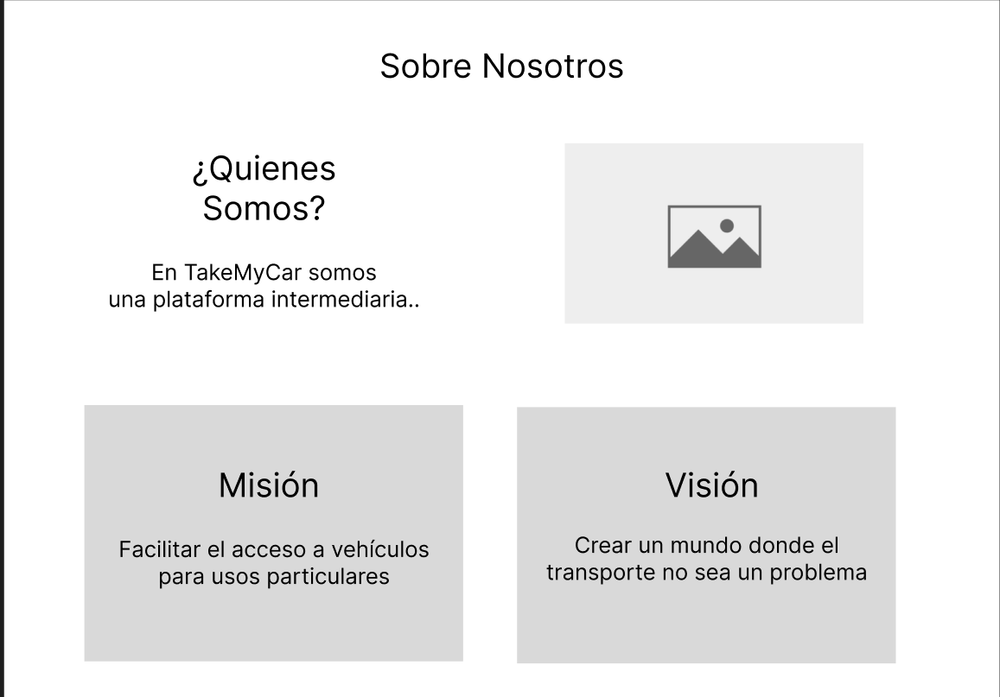
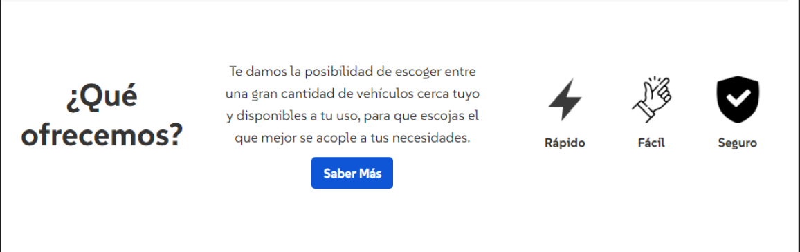
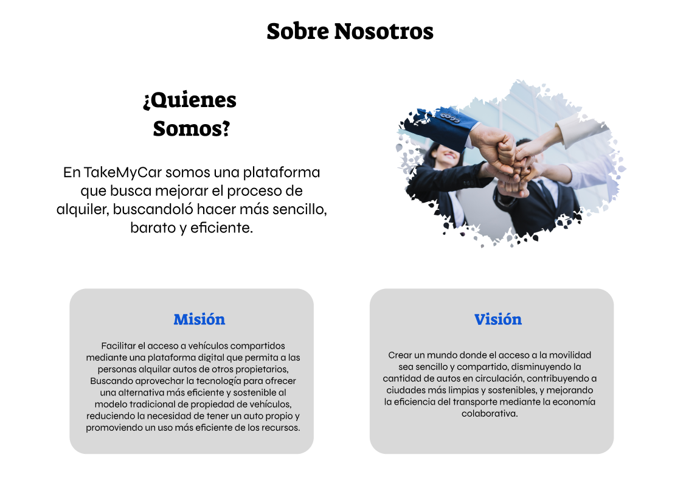
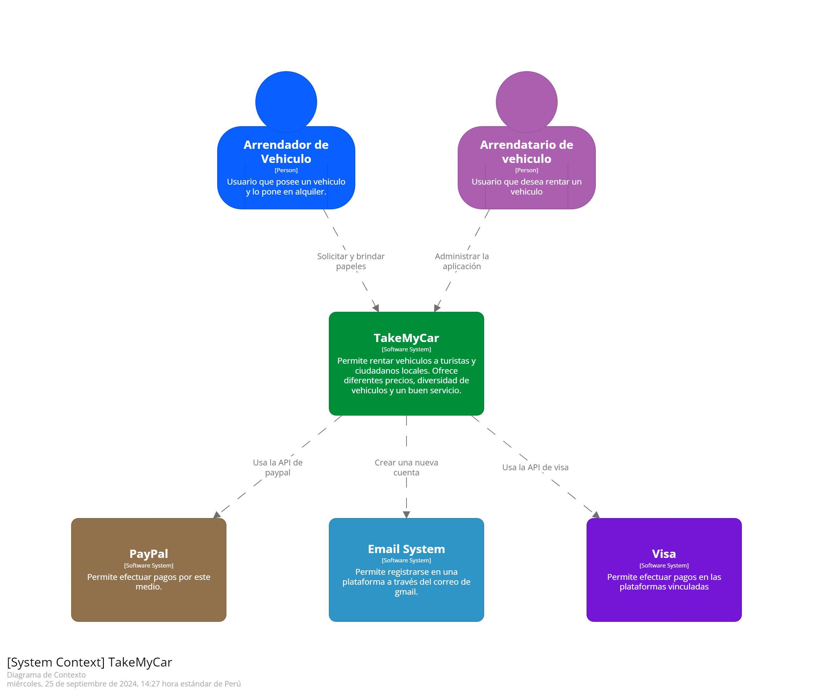
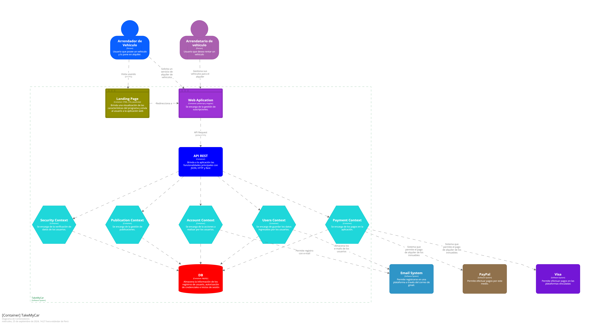

# Capítulo IV: Product Design

## 4.1. Style Guidelines

### 4.1.1 General Style Guidelines

**Paleta de colores**: Nuestra selección en la paleta de colores se basa en la atención a la legibilidad y buen aspecto de nuestra landing page. El color #002e43 se usa como color principal para resaltar elemento importantes, luego el color #406378 se usa para subtítulos y otros apartados de una ligera menor relevancia, en el caso del color #6a90a9 se utiliza en el cuerpo y en otras áreas para contrastar con los títulos y subtítulos, finalmente para los colores #b2c3d3 y #d7dce0 se usarán de fondo. Estos colores se usarán de forma inteligente para poder presentar una jerarquía visual clara e intuitiva.

  

**Branding**: Para el branding de nuestra empresa se creó el nombre de la marca con el objetivo de establecer una identidad, presencia relevante e imponente en el mercado. Para una mejor identificación de nuestra empresa se creó el logo:

 

**Tipografía**: Para dar una aire diferente a nuestra marca se ha optado por el uso de la fuente “Suse" que presenta una gran variedad de estilos. Esta fuente debe ser símbolo de nuestra marca y de cumplir el objetivo de transmitir información con una identidad visual sólida y reconocible. Adicionalmente, esta tipografía es apropiada para lograr un diseño cohesivo y equilibrado que contribuye a nuestro reconocimiento en el mercado objetivo.

  

**Spacing**: Se hará uso de un espaciado pertinente para no abrumar al cliente con textos abarrotados que no contribuyen a la estética y contrariamente desmotivan a leer. Además, un correcto uso del espaciado en el texto también puede dar la impresión de una página más limpia y moderna, que es uno de los objetivos que hemos planteado para crear un mejor ambiente para el cliente.

**Tono de comunicación**: El tono usado en el proyecto será del tipo formal, además de que se usará un lenguaje respetuoso, con el objetivo de mantener una comunicación estrictamente profesional con el cliente. Sin embargo, en algunas secciones se usará también un tono entusiasta o sereno para atraer al cliente a probar el producto.

### 4.1.2 Web Style Guidelines

**Colores**: En nuestro enfoque para diseñar nuestra página web, hemos elegido cuidadosamente una paleta de colores que refleje la identidad y los valores de nuestra marca. Con el azul eléctrico como color principal, buscamos transmitir una sensación de energía, modernidad y confianza a nuestros visitantes.Adicionalmente utilizamos colores complementarios como #406378,#6a90a9 ,#b2c3d3,#d7dce0 y el color negro para dar contraste en los menus.

  

**Tipografía**: Además, hemos optado por emplear la tipografía Reboto Mono debido a su estilo moderno y legible, que se alinea perfectamente con la estética contemporánea que deseamos transmitir en nuestra página web, adicionalmente pensamos usar los distintos tamaños de letra según sea necesario en el texto de cara a dar una mejor perspectiva de jerarquía en el texto, así podremos separar los títulos, subtítulos y el cuerpo de una mejor forma.

  

**Formas**: Se decidió emplear figuras con bordes ligeramente redondeados en el proyecto para proporcionar una apariencia más ordenada y pulida, lo que contribuye a una experiencia visual más agradable para los usuarios.

Además, en el desarrollo de nuestros mock-ups y wireframes, se emplearon dos tipos de pantallas comunes: escritorio y móvil. La versión de escritorio estuvo más dirigida a nuestro segmento de administradores del taller, mientras que la versión móvil estuvo destinada al segmento de propietarios de vehículos.

## 4.2. Information Architecture

Centrados en el objetivo de nuestra plataforma "TakeMyCar", buscamos proporcionar una interfaz amigable, confiable y segura para el alquiler de vehículos. Nuestro enfoque es garantizar que los usuarios puedan navegar fácilmente, encontrar el auto que mejor se adapte a sus necesidades y realizar reservaciones de manera eficiente. A continuación, se detalla la arquitectura de información para las principales páginas de la plataforma.

<b> 1. Página de Inicio: </b>

- Mensaje de Bienvenida: Un mensaje introductorio que explique brevemente nuestra misión y lo que ofrecemos, destacando la facilidad y seguridad para alquilar autos.

- Vista Previa de Autos Disponibles: Sección con imágenes y descripciones breves de los autos más populares o recientemente agregados a la flota, con opciones para ver más detalles.

- Footer y Header:

  - Header: Incluye el menú de navegación con enlaces a las páginas principales: Inicio, Alquilar, Sobre Nosotros, y Contactanos.
  - Footer: Información sobre políticas de privacidad, términos de servicio, enlaces a redes sociales y detalles de contacto.

<b> 2. Página de Alquilar: </b>

- Listado de Autos Disponibles: Vista general de todos los autos disponibles para alquiler, mostrando imágenes, marcas, modelos, características principales (como capacidad, tipo de transmisión y combustible).

- Filtros de Búsqueda: Herramientas para filtrar autos por tipo, precio, modelo, capacidad, transmisión, combustible, entre otros, para facilitar la selección.

- Reserva de Autos: En cada auto se proporciona un botón para iniciar el proceso de reserva, donde el usuario puede seleccionar fechas y completar su reserva.

- Formulario de Reservación: Interfaz donde el usuario ingresa información personal básica, selecciona las fechas del alquiler y el lugar de recogida o entrega.

- Pagos por Reserva: Opción de pagos en línea, donde el usuario puede completar el pago de la reserva utilizando diversos métodos (tarjeta de crédito, PayPal, etc.).

<b> 3. Página de Sobre Nosotros: </b>

- Información del Proyecto: Explicación sobre qué es "RentAuto", nuestra misión, valores y cómo buscamos diferenciarnos en el mercado de alquiler de autos.

- Grupo de Trabajo: Breve introducción del equipo detrás de la plataforma, destacando la experiencia y compromiso con el servicio al cliente.

<b> 4. Página de Contactanos: </b>

- Información de Contacto: Sección donde los usuarios pueden encontrar formas de contactarnos, incluyendo un número de teléfono, correo electrónico y formulario de contacto.

- Formulario de Contacto: Los usuarios pueden enviar mensajes directamente desde el sitio web, proporcionando su nombre, correo electrónico y el motivo de la consulta.

- Ubicación y Horarios de Atención: Información sobre nuestra ubicación física, si es aplicable, y los horarios de atención para consultas o recogida de autos.

### 4.2.1 Organization Systems:

La organización de la información en "TakeMyCar" tiene como objetivo optimizar la experiencia del usuario, permitiendo una navegación rápida y eficaz a través de nuestras páginas.

<b> 1. Categorización de la Información: </b>

- Autos Disponibles: Los autos se organizan por categorías como tipo de auto (sedán, SUV, deportivo, etc.), modelo, y características principales.

- Información del Alquiler: La información relevante para el alquiler, como precios, fechas disponibles y características adicionales, se organiza de manera accesible en las páginas de detalle de los autos.

<b> 2. Filtros y Búsqueda: </b>

- Filtros en la Página de Alquilar: Los usuarios pueden filtrar autos según el tipo de vehículo, precio diario, marca, transmisión y combustible.

- Búsqueda Avanzada: Opción para buscar autos con características específicas como "SUV automáticos con capacidad para 7 personas".

<b> 3. Interfaz Intuitiva: </b>

- Navegación clara con acceso rápido a las secciones principales como Alquilar o Contáctanos.

<b> 4. Funcionalidades Específicas: </b>

- Información detallada de vehículos, es decir, páginas individuales de productos que muestran imágenes detalladas, descripciones completas y opciones de personalización disponibles.

### 4.2.2 Labeling Systems:

Para mejorar la claridad y simplicidad, cada página y sección utilizará etiquetas claras. En otras palabras, usaremos el sistema de etiquetado como parte escencial para el uso de buenas prácticas y mantener la dirección de cada segmento a su propósito:

- Alquilar Autos
- Reservar
- Sobre Nosotros
- Contáctanos
- Entre otros.s

### 4.2.3. SEO Tags and Meta Tag

A continuación, mostraremos las etiquetas que representarán el contenido presentado tanto en nuestra aplicación web como en nuestra página de inicio. Estas etiquetas facilitarán la identificación y localización de TakeMyCar.

1. Landing Page:

   - Title: TakeMyCar

   - Description: TakeMyCar - Oficial Landing Page

   - Keywords: Vehicles, Rent, Rates.

   - Authors: TakeMyCar team

2. Web application:

   - Title: TakeMyCar

   - Description: TakeMyCar - Oficial Web Site

   - Keywords: Vehicles, Brands, Prices, Rent, Locations.

   - Authors: TakeMyCar team

### 4.2.4. Searching Systems

Se implementaron dos funcionalidades de búsqueda similares con el objetivo de mejorar la experiencia de usuario al facilitar la búsqueda de información deseada.

El primero de estos sistemas se encuentra en la sección de "Vehicles" de la aplicación. Aquí, los usuarios tienen acceso a una lista completa de todas los vehiculos disponibles. Para agilizar la localización de vehiculos con la posiblidad de aplicar filtros, demás de la incorporación de una barra de búsqueda que permite introducir términos clave para encontrar rápidamente una marca o módelo.

Por otro lado, el segundo sistema de búsqueda se encuentra en la sección de "Locations". En esta sección, los usuarios pueden de entre todas las posibles ubicación ya sea para el lugar de recogida o despacho. Además de la búsqueda por ciudad, se han implementado filtros adicionales que permiten refinar la búsqueda según la cercanía y disponibilidad de horario. Esta funcionalidad proporciona a los usuarios una experiencia más amigable y facilita su interacción con la aplicación.

### 4.2.5. Navigation Systems

El sistema de navegación debe proporcionar una experiencia fluida para que los usuarios puedan moverse rápidamente entre las secciones principales de la plataforma.

1. Menú Principal: Un menú ubicado en la parte superior de cada página con enlaces a Inicio, Alquilar, Sobre Nosotros, y Contactanos.

2. Navegación Contextual: Dentro de las páginas de alquiler, habrá submenús que permitan acceder a filtros específicos o detalles sobre los autos disponibles.

3. Botones de Acción Destacados: En la página de Alquilar y en la página de Inicio, los botones de acción (como "Reservar Ahora") serán visibles y accesibles para facilitar la interacción.

4. Búsqueda y Filtros Visibles: La barra de búsqueda y los filtros estarán disponibles en la página de Alquilar para que los usuarios puedan buscar fácilmente el auto que desean.

5. Flujo de Navegación Intuitivo: El flujo guiará a los usuarios desde la exploración de autos hasta la finalización de la reserva, con señales visuales claras y botones destacados para realizar acciones.

## 4.3. Landing Page UI Design

### 4.3.1 Landing Page Wireframe.

<b>Inicio</b>

  

<b>¿Qué Ofrecemos?</b>

  

<b>Sobre Nosotros</b>

  

<b>Contactanos</b>

  

Link Figma: https://www.figma.com/design/MBSIX1vJn3vkom8QoemG9p/Landing-Page-Wireframes-and-Mock-Up?node-id=0-1&t=ZaWVeTFBY7IddA7d-1

### 4.3.2. Landing Page Mock-up.

Tomando en cuenta los Wireframes, adoptado una estructura uniforme para todas las páginas, integrando la paleta de colores, tipografía otros recursos ya preseleccionados.

<b>Inicio</b>

  

<b>¿Qué Ofrecemos?</b>

  

<b>Sobre Nosotros</b>

  

<b>Contactanos</b>

  

Link Figma: https://www.figma.com/design/MBSIX1vJn3vkom8QoemG9p/Landing-Page-Wireframes-and-Mock-Up?node-id=0-1&t=ZaWVeTFBY7IddA7d-1

## 4.4. Web Applications UX/UI Design

Link Figma : https://www.figma.com/design/IJfwgFrR0vsiqOXYDn6wkZ/Web-Application-PixelSmiths?node-id=207-8737&t=vF3XfAgs62TSKFmu-1

### 4.4.1. Web Applications Wireframes

Tomando en cuenta nuestras entrevistas para el segmento de propietarios de uno o más vehículos propios, se prefiere un entorno de escritorio en el que hemos integrado funcionalidades como la gestión de vehiculos, añadir vehiculos, la administración de facturas de alquileres y la modificación del perfil.

  

  

  

Por otro lado, para el segmento de usuarios que tienen la necesidad de alquilar un vehículo, se prefiere un entorno movil en el que hemos integrado funcionalidades como la visualización de los vehiculos más populares, la busqueda con los filtros, historial y el perfil.

  

  

  

### 4.4.2. Web Applications Wireflow Diagrams

Link Figma: https://www.figma.com/design/dZSCx2YrXRhKRyAgHA4z5a/Diagrams?m=auto&t=e87i3klynaRUQMdm-1

### 4.4.3. Web Applications Mock-ups

Link Figma: https://www.figma.com/design/dZSCx2YrXRhKRyAgHA4z5a/Diagrams?m=auto&t=e87i3klynaRUQMdm-1

### 4.4.4. Web Applications User Flow Diagrams

Link Figma: https://www.figma.com/design/dZSCx2YrXRhKRyAgHA4z5a/Diagrams?m=auto&t=e87i3klynaRUQMdm-1

## 4.5. Web Applications Prototyping

## 4.6. Domain-Driven Software Architecture

Para la construcción de los diagramas, se utilizó la herramienta Structurizr.

### 4.6.1. Software Architecture Context Diagram

  

### 4.6.2. Software Architecture Container Diagrams

  

### 4.6.3. Software Architecture Components Diagrams

#### Bounded Context: Account

  

#### Bounded Context: Users

  

#### Bounded Context: Payment

  

#### Bounded Context: Publication

  

#### Bounded Context: Security

  

## 4.7. Software Object-Oriented Design

En este capitulo veremos el diseño de nuestros "objetos". Estos objetos representan entidades o conceptos del mundo real que tienen tanto datos (atributos) como comportamientos (métodos). Este enfoque facilita la construcción de software complejo mediante la división del problema en componentes más pequeños y manejables que interactúan entre sí de manera predecible y estructurada.

### 4.7.1. Class Diagrams

En este diagrama de clases se muestran las clases que componen la aplicación TakeMyCar.

### 4.7.2. Class Dictionary

En este apartado detallamos cada clase de nuestro diagrama

 

    <h3>User Class</h3>
    <table>
      <thead>
          <tr>
              <th>Attribute</th>
              <th>Type</th>
              <th>Description</th>
          </tr>
      </thead>
      <tbody>
          <tr>
              <td>id</td>
              <td>string</td>
              <td>Identificador único del usuario</td>
          </tr>
          <tr>
              <td>name</td>
              <td>string</td>
              <td>Nombre del usuario</td>
          </tr>
          <tr>
              <td>email</td>
              <td>string</td>
              <td>Correo electrónico del usuario</td>
          </tr>
          <tr>
              <td>password</td>
              <td>string</td>
              <td>Contraseña del usuario</td>
          </tr>  
          <tr>
              <td>address</td>
              <td>string</td>
              <td>Dirección del usuario</td>
          </tr>
          <tr>
              <td>phone</td>
              <td>string</td>
              <td>Telefono del usuario</td>
          </tr> 
          <tr>
              <td>createdAt</td>
              <td>date</td>
              <td>Fecha de Registro del usuario</td>
          </tr>
        <tr>
              <td>role</td>
              <td>list</td>
              <td>Rol de usuario</td>
          </tr>
      </tbody>
    </table>
    <h3>Vehicle Class</h3>
    <table>
      <thead>
          <tr>
              <th>Attribute</th>
              <th>Type</th>
              <th>Description</th>
          </tr>
      </thead>
      <tbody>
          <tr>
              <td>id</td>
              <td>int</td>
              <td>Identificador único del vehiculo</td>
          </tr>
          <tr>
              <td>propietaryId</td>
              <td>int</td>
              <td>Identificador del Propietario</td>
          </tr>
          <tr>
              <td>brand</td>
              <td>string</td>
              <td>Marca del vehiculo</td>
          </tr>
          <tr>
              <td>model</td>
              <td>string</td>
              <td>Modelo del vehiculo</td>
          </tr>
          <tr>
              <td>priceByDay</td>
              <td>int</td>
              <td>Precio de arrendamiento vehiculo</td>
          </tr>
          <tr>
              <td>yean</td>
              <td>int</td>
              <td>Año de arrendamiento vehiculo</td>
          </tr>
          <tr>
              <td>plate</td>
              <td>string</td>
              <td>Placa del vehiculo</td>
          </tr>
          <tr>
              <td>color</td>
              <td>string</td>
              <td>Color del vehiculo</td>
          </tr>
          <tr>
              <td>km</td>
              <td>float</td>
              <td>Kilometraje del vehiculo</td>
          </tr>
          <tr>
              <td>images</td>
              <td>string list</td>
              <td>Imagenes del vehiculo</td>
          </tr>
      </tbody>
    </table>
    <h3>Booking class</h3>
    <table>
      <thead>
          <tr>
              <th>Attribute</th>
              <th>Type</th>
              <th>Description</th>
          </tr>
      </thead>
      <tbody>
          <tr>
              <td>id</td>
              <td>int</td>
              <td>Identificador único de la reserva</td>
          </tr>
          <tr>
              <td>vehicleID</td>
              <td>int</td>
              <td>Identificardo de cada vehiculo</td>
          </tr>
          <tr>
              <td>renterId</td>
              <td>string</td>
              <td>Identificador de cada usuario arrendatario</td>
          </tr>
          <tr>
              <td>startDate</td>
              <td>date</td>
              <td>Fecha de inicio de cada reserva</td>
          </tr>
          <tr>
              <td>endDate</td>
              <td>date</td>
              <td>Fecha de fin de cada reserva</td>
          </tr>
          <tr>
              <td>bookingState</td>
              <td>int</td>
              <td>Estado de cada reserva</td>
          </tr>
          <tr>
              <td>totalPrice</td>
              <td>float</td>
              <td>Precio de cada reserva</td>
          </tr>
      </tbody>
    </table>
    <h3>Invoice class</h3>
    <table>
      <thead>
          <tr>
              <th>Attribute</th>
              <th>Type</th>
              <th>Description</th>
          </tr>
      </thead>
      <tbody>
        <tr>
            <td>id</td>
            <td>int</td>
            <td>Identificador único de los pagos</td>
        </tr>
        <tr>
            <td>bookingId</td>
            <td>Booking</td>
            <td>Identificador de las reservas</td>
        </tr>
        <tr>
            <td>ammount</td>
            <td>float</td>
            <td>Monto de cada reserva</td>
        </tr>
        <tr>
            <td>paymentDate</td>
            <td>date</td>
            <td>Fecha de la pago de una reserva</td>
        </tr>
        <tr>
            <td>paymentMethod</td>
            <td>list</td>
            <td>metodo de pago de cada reserva</td>
        </tr>
        <tr>
            <td>paymentState</td>
            <td>list</td>
            <td>Estado de pago dla reserva</td>
        </tr>
      </tbody>
    </table>
    <h3>Review Class</h3>
    <table>
      <thead>
          <tr>
              <th>Attribute</th>
              <th>Type</th>
              <th>Description</th>
          </tr>
      </thead>
      <tbody>
        <tr>
            <td>id</td>
            <td>int</td>
            <td>Identificador de las reseñas</td>
        </tr>
        <tr>
            <td>authorId</td>
            <td>Booking</td>
            <td>Reserva observada</td>
        </tr>
        <tr>
            <td>vehicleId</td>
            <td>User</td>
            <td>Usuario relacionado</td>
        </tr>
        <tr>
            <td>rating</td>
            <td>int</td>
            <td>Calificacion</td>
        </tr>
        <tr>
            <td>comment</td>
            <td>string</td>
            <td>Comentario</td>
        </tr>
        <tr>
            <td>createdAt</td>
            <td>string</td>
            <td>Fecha de la reseña</td>
        </tr>
      </tbody>
    </table>
    <h3>Message class</h3>
      <table>
        <thead>
            <tr>
                <th>Attribute</th>
                <th>Type</th>
                <th>Description</th>
            </tr>
        </thead>
        <tbody>
          <tr>
              <td>id</td>
              <td>int</td>
              <td>Identificador único de cada mensaje</td>
          </tr>
          <tr>
              <td>senderID</td>
              <td>User</td>
              <td>Usuario que envia un mensaje</td>
          </tr>
          <tr>
              <td>receiverID</td>
              <td>User</td>
              <td>Usuario que recibe un mensaje</td>
          </tr>
          <tr>
              <td>content</td>
              <td>string</td>
              <td>Fecha del recordatorio</td>
          </tr>
          <tr>
              <td>createdAt</td>
              <td>date</td>
              <td>Fecha del mensaje</td>
          </tr>
        </tbody>
      </table>
  

## 4.8. Database Design

### 4.8.1. Database Diagram

  
